警察局分佈與案發地區分析
================

B0144201戴維政 B0444228林鈺潔

分析議題背景
------------

在風聲鶴唳，草木皆兵的社會中，走在路上都有可能被砍，犯罪層出不窮。

分析動機
--------

總是在新聞上看到令人無法想像的行為，警察的存在對罪犯而言似乎毫無威脅，因此想分析各地區派出所的數量是否會影響犯罪的數量，進一步探討警力的強度和存在的必要性。

使用資料
--------

派出所的所在地點以及近兩年的犯罪分佈地點

``` r
library(readr)
```

    ## Warning: package 'readr' was built under R version 3.2.5

``` r
policeS <- read_csv("~/Downloads/policeS.csv")
```

    ## Parsed with column specification:
    ## cols(
    ##   中文單位名稱 = col_character(),
    ##   英文單位名稱 = col_character(),
    ##   郵遞區號 = col_integer(),
    ##   地址 = col_character(),
    ##   電話 = col_character(),
    ##   POINT_X = col_double(),
    ##   POINT_Y = col_double()
    ## )

``` r
library(readxl)
```

    ## Warning: package 'readxl' was built under R version 3.2.5

``` r
m1 <- read_csv("~/Downloads/opendata105N010.csv", skip = 1)
```

    ## Parsed with column specification:
    ## cols(
    ##   統計年 = col_integer(),
    ##   區域別 = col_character(),
    ##   年底人口數 = col_character(),
    ##   土地面積 = col_double(),
    ##   人口密度 = col_character()
    ## )

``` r
台灣人口 <- read_excel("~/Downloads/台灣人口.xlsx")
X10401_10403犯罪資料 <- read_csv("~/Downloads/10401-10403犯罪資料.csv") 
```

    ## Parsed with column specification:
    ## cols(
    ##   案類 = col_character(),
    ##   發生日期 = col_integer(),
    ##   發生地點 = col_character()
    ## )

``` r
X10404_10406犯罪資料 <- read_csv("~/Downloads/10404-10406犯罪資料.csv") 
```

    ## Warning: Missing column names filled in: 'X4' [4]

    ## Parsed with column specification:
    ## cols(
    ##   案類 = col_character(),
    ##   發生日期 = col_integer(),
    ##   發生地點 = col_character(),
    ##   X4 = col_character()
    ## )

``` r
X10407_10409犯罪資料 <- read_csv("~/Downloads/10407-10409犯罪資料.csv") 
```

    ## Warning: Missing column names filled in: 'X4' [4]

    ## Parsed with column specification:
    ## cols(
    ##   案類 = col_character(),
    ##   發生日期 = col_integer(),
    ##   發生地點 = col_character(),
    ##   X4 = col_character()
    ## )

``` r
X10410_10412犯罪資料 <- read_csv("~/Downloads/10410-10412犯罪資料.csv") 
```

    ## Warning: Missing column names filled in: 'X4' [4]

    ## Parsed with column specification:
    ## cols(
    ##   案類 = col_character(),
    ##   發生日期 = col_integer(),
    ##   發生地點 = col_character(),
    ##   X4 = col_character()
    ## )

``` r
X10501_10503犯罪資料 <- read_csv("~/Downloads/10501-10503犯罪資料.csv")
```

    ## Warning: Missing column names filled in: 'X4' [4]

    ## Parsed with column specification:
    ## cols(
    ##   案類 = col_character(),
    ##   發生日期 = col_integer(),
    ##   發生地點 = col_character(),
    ##   X4 = col_character()
    ## )

``` r
X10504_10506犯罪資料 <- read_csv("~/Downloads/10504-10506犯罪資料.csv")
```

    ## Warning: Missing column names filled in: 'X4' [4]

    ## Parsed with column specification:
    ## cols(
    ##   案類 = col_character(),
    ##   發生日期 = col_integer(),
    ##   發生地點 = col_character(),
    ##   X4 = col_character()
    ## )

``` r
X10507_10509犯罪資料 <- read_csv("~/Downloads/10507-10509犯罪資料.csv")
```

    ## Warning: Missing column names filled in: 'X4' [4]

    ## Parsed with column specification:
    ## cols(
    ##   案類 = col_character(),
    ##   發生日期 = col_integer(),
    ##   發生地點 = col_character(),
    ##   X4 = col_character()
    ## )

``` r
X10510_10512犯罪資料 <- read_csv("~/Downloads/10510-10512犯罪資料.csv")
```

    ## Warning: Missing column names filled in: 'X4' [4]

    ## Parsed with column specification:
    ## cols(
    ##   案類 = col_character(),
    ##   發生日期 = col_integer(),
    ##   發生地點 = col_character(),
    ##   X4 = col_character()
    ## )

資料處理與清洗
--------------

將近兩年的犯罪資料以地區做合併 再以犯罪資料的發生地區和派出所清理後的地址做合併

``` r
Crimeall<-rbind(X10401_10403犯罪資料,X10404_10406犯罪資料[,1:3],X10407_10409犯罪資料[,1:3],X10410_10412犯罪資料[,1:3],X10501_10503犯罪資料[,1:3],X10504_10506犯罪資料[,1:3],X10507_10509犯罪資料[,1:3],X10510_10512犯罪資料[,1:3])
library(ggmap)
```

    ## Loading required package: ggplot2

    ## Warning: package 'ggplot2' was built under R version 3.2.5

``` r
library(ggplot2)
library(datasets)
library("dplyr")
```

    ## Warning: package 'dplyr' was built under R version 3.2.5

    ## 
    ## Attaching package: 'dplyr'

    ## The following objects are masked from 'package:stats':
    ## 
    ##     filter, lag

    ## The following objects are masked from 'package:base':
    ## 
    ##     intersect, setdiff, setequal, union

``` r
policeS_clean<-select(policeS,1:7,-2,-3,-5)
Crimeall$發生地點 <-substr(Crimeall$發生地點, start=1,stop=3)
policeS_clean$地址 <- substr(policeS_clean$地址, start=1,stop=3)
policeS_clean$地址 <-gsub("臺北市","台北市",policeS_clean$地址)
policeS_clean$地址 <-gsub("臺南市","台南市",policeS_clean$地址)
policeS_clean$地址 <-gsub("臺中市","台中市",policeS_clean$地址)
policeS_clean$地址 <-gsub("臺東縣","台東縣",policeS_clean$地址)

m2<-select(m1,1:4,-1,-3)
m2$區域別<-substr(m2$區域別,start = 1,stop=3)

m2_F<-group_by(m2[1:368,],區域別)%>%
  summarise(土地總面積=sum(土地面積))
m2_F[1,1]<-"Kaohsiung"
m2_F[2,1]<-"Hualien"
m2_F[3,1]<-"Keelung"
m2_F[4,1]<-"ChiayiCity"
m2_F[5,1]<-"ChiayiCounty"
m2_F[6,1]<-"Kinmen"
m2_F[7,1]<-"Lianjiang"
m2_F[8,1]<-"Miaoli"
m2_F[9,1]<-"Nantou"
m2_F[10,1]<-"Penghu"
m2_F[11,1]<-"Pingtung"
m2_F[12,1]<-"Taipei"
m2_F[13,1]<-"Taitung"
m2_F[14,1]<-"Tainan"
m2_F[15,1]<-"Taichung"
m2_F[16,1]<-"Taoyuan"
m2_F[17,1]<-"NewTaipei"
m2_F[18,1]<-"HsinchuCity"
m2_F[19,1]<-"HsinchuCounty"
m2_F[20,1]<-"Yilan"
m2_F[21,1]<-"Yunlin"
m2_F[22,1]<-"Changhua"

colnames(m2_F)<-c("County","place")


policeF<-group_by(policeS_clean,地址)%>%
  summarise(警察局數量=n())
CrimeF<-group_by(Crimeall,發生地點)%>%
    summarise(案件數量=n())
P_C_F<-inner_join(policeF,CrimeF,by=c("地址"="發生地點"))
P_C_F$犯罪率<-P_C_F$案件數量/sum(P_C_F$案件數量)
colnames(P_C_F) <- c("County","NumbersofPoliceStation","NumbersofCriminal","Rate")
P_C_F[1,1]<-"Kaohsiung"
P_C_F[2,1]<-"Hualien"
P_C_F[3,1]<-"Keelung"
P_C_F[4,1]<-"ChiayiCity"
P_C_F[5,1]<-"ChiayiCounty"
P_C_F[6,1]<-"Kinmen"
P_C_F[7,1]<-"Lianjiang"
P_C_F[8,1]<-"Miaoli"
P_C_F[9,1]<-"Nantou"
P_C_F[10,1]<-"Penghu"
P_C_F[11,1]<-"Pingtung"
P_C_F[12,1]<-"Taipei"
P_C_F[13,1]<-"Taitung"
P_C_F[14,1]<-"Tainan"
P_C_F[15,1]<-"Taichung"
P_C_F[16,1]<-"Taoyuan"
P_C_F[17,1]<-"NewTaipei"
P_C_F[18,1]<-"HsinchuCity"
P_C_F[19,1]<-"HsinchuCounty"
P_C_F[20,1]<-"Yilan"
P_C_F[21,1]<-"Yunlin"
P_C_F[22,1]<-"Changhua"
colnames(台灣人口)<-c("County","people")
All1<-inner_join(P_C_F,台灣人口,by="County")
All2<-inner_join(All1,m2_F,by="County")
All2$StationDensity<-All2$NumbersofPoliceStation/All2$place
All2$PeopleDensity<-All2$people/All2$place
All3<-All2[-12,]

P_C_F_Criminal<-P_C_F[order(P_C_F$NumbersofCriminal,decreasing=T),]
P_C_F_PoliceStation<-P_C_F[order(P_C_F$NumbersofPoliceStation,decreasing = T),]
All2_StationDensity<-All2[order(All2$StationDensity,decreasing = T),]
All2_PeopleDensity<-All2[order(All2$PeopleDensity,decreasing = T),]

ggplot(P_C_F_Criminal, aes(x = County, y = NumbersofCriminal)) + geom_bar(stat = "identity")+coord_flip()
```

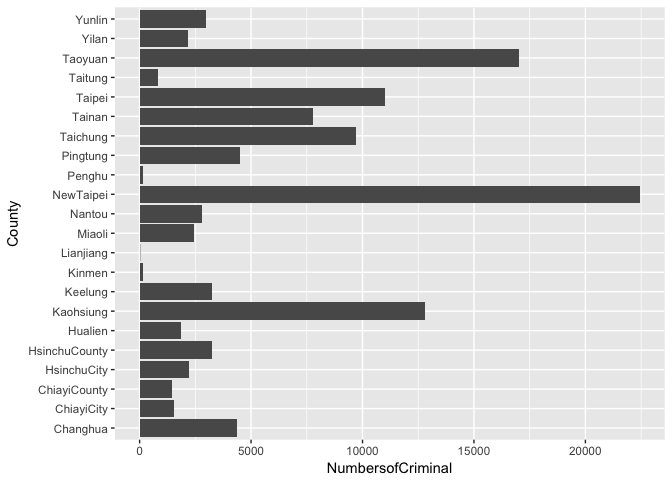

``` r
ggplot(All2_StationDensity, aes(x = County, y = StationDensity)) + geom_bar(stat = "identity")+coord_flip()
```

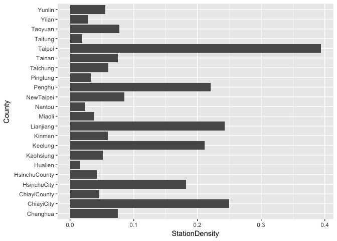

``` r
ggplot(All2_PeopleDensity, aes(x = County, y = PeopleDensity)) + geom_bar(stat = "identity")+coord_flip()
```

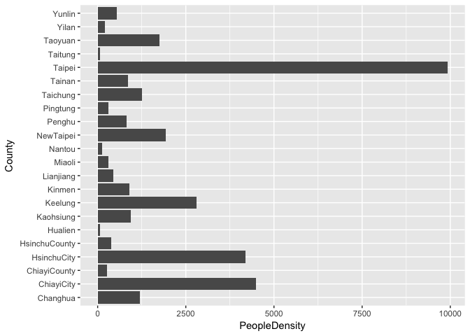

``` r
ggplot(All2, aes(x = County, y = people)) + geom_bar(stat = "identity")+coord_flip()
```

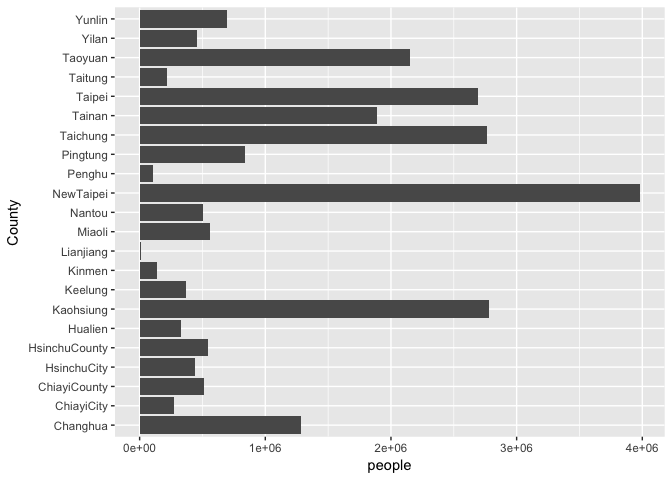

``` r
ggplot(All2, aes(x = County, y =NumbersofPoliceStation )) + geom_bar(stat = "identity")+coord_flip()
```

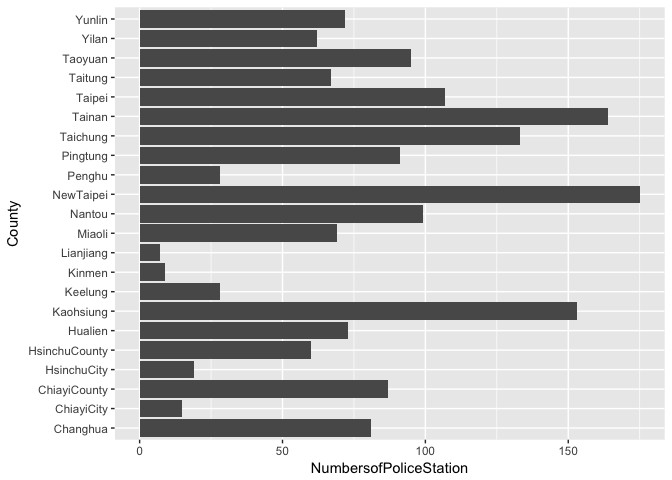

``` r
## 探索式資料分析
```

``` r
TWD97TM2toWGS84 <- function (input_lat, input_lon){  
  # input_lat: TWD97橫座標, 南北緯度, latitude N
  # input_lon: TWD97縱座標, 東西經度, longitude E
  
  input_lat <- input_lat %>% as.character %>% as.numeric()
  input_lon <- input_lon %>% as.character %>% as.numeric()
  
  a = 6378137.0
  b = 6356752.314245
  lon0 = 121 * pi / 180
  k0 = 0.9999
  dx = 250000
  dy = 0
  e = (1 - b^2 / a^2)^0.5
  
  
  x =  input_lat - dx # input_lat: TWD97橫座標, 緯度, latitude
  y =  input_lon - dy # input_lon: TWD97縱座標, 經度, longitude
  
  M = y/k0
  
  mu = M/(a*(1.0 - ( e**2 )/4.0 - 3* (e**4)/64.0 - 5* (e**6)/256.0))
  e1 = (1.0 -  ((1.0 -  (e**2))**0.5)) / (1.0 +  ((1.0 -  (e**2))**0.5))
  
  J1 = (3*e1/2 - 27* (e1**3)/32.0)
  J2 = (21* (e1**2)/16 - 55* (e1**4)/32.0)
  J3 = (151* (e1**3)/96.0)
  J4 = (1097* (e1**4)/512.0)
  
  fp = mu + J1*sin(2*mu) + J2*sin(4*mu) + J3*sin(6*mu) + J4*sin(8*mu)
  
  e2 =  ((e*a/b)**2)
  C1 =  (e2*cos(fp)**2)
  T1 =  (tan(fp)**2)
  R1 = a*(1- (e**2))/ ((1- (e**2)* (sin(fp)**2))**(3.0/2.0))
  N1 = a/ ((1- (e**2)* (sin(fp)**2))**0.5)
  
  D = x/(N1*k0)
  
  #緯度計算 latitude
  Q1 = N1*tan(fp)/R1
  Q2 = ( (D**2)/2.0)
  Q3 = (5 + 3*T1 + 10*C1 - 4* (C1**2) - 9*e2)* (D**4)/24.0
  Q4 = (61 + 90*T1 + 298*C1 + 45* (T1**2) - 3* (C1**2) - 252*e2)* (D**6)/720.0
  lat = fp - Q1*(Q2 - Q3 + Q4)
  
  #經度計算 longitude
  Q5 = D
  Q6 = (1 + 2*T1 + C1)* (D**3)/6
  Q7 = (5 - 2*C1 + 28*T1 - 3* (C1**2) + 8*e2 + 24* (T1**2))* (D**5)/120.0
  lon = lon0 + (Q5 - Q6 + Q7)/cos(fp)
  
  
  lat = (lat*180) /pi #南北緯度  latitude 
  lon = (lon*180)/ pi #東西經度  longitude

  WGS = list(lat = lat, lon = lon)
  return(WGS)
}
song<-TWD97TM2toWGS84(policeS_clean$POINT_X,policeS_clean$POINT_Y)

policeS_clean$POINT_X<-song$lat
policeS_clean$POINT_Y<-song$lon

tymap <- get_map(location = 'NewTaipei', 
                 zoom = 13,
                 language = "zh-TW",maptype = 'roadmap')
```

    ## Map from URL : http://maps.googleapis.com/maps/api/staticmap?center=NewTaipei&zoom=13&size=640x640&scale=2&maptype=roadmap&language=zh-TW&sensor=false

    ## Information from URL : http://maps.googleapis.com/maps/api/geocode/json?address=NewTaipei&sensor=false

``` r
policeS_tymap <- ggmap(tymap) +geom_point(data=policeS_clean, 
               aes(x=as.numeric(POINT_Y), y=as.numeric(POINT_X),color="red",size=0.5))+ guides(size=FALSE)
policeS_tymap
```

    ## Warning: Removed 1616 rows containing missing values (geom_point).

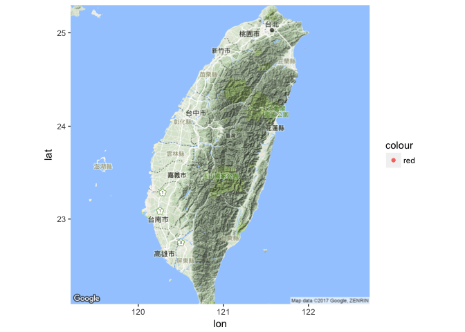

``` r
ggplot(All2,
       aes(x=PeopleDensity,
           y=NumbersofPoliceStation))+
  geom_point()+
  geom_smooth(method = "glm")
```

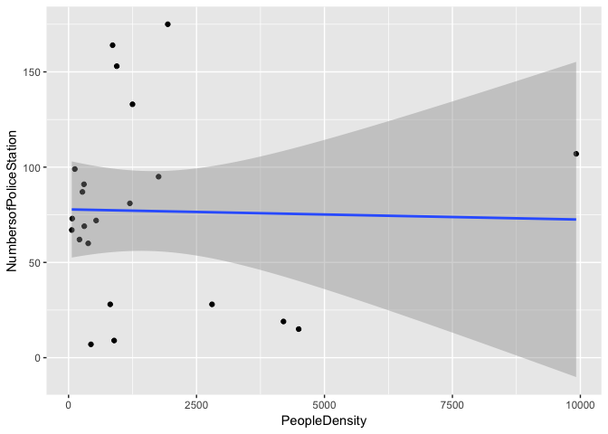

``` r
ggplot(All2,
       aes(x=people,
           y=NumbersofPoliceStation))+
  geom_point()+
  geom_smooth(method = "glm")
```

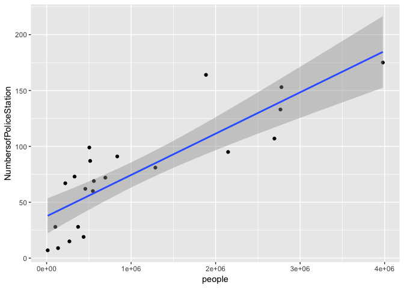

``` r
ggplot(All2,
       aes(x=NumbersofCriminal,
           y=NumbersofPoliceStation))+
  geom_point()+
  geom_smooth(method = "glm")
```

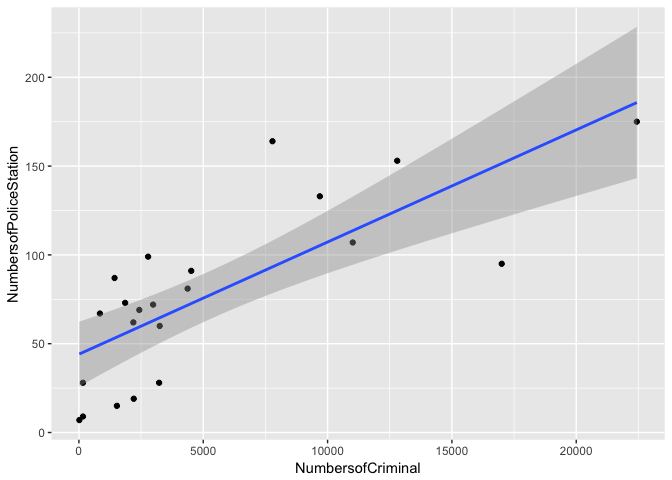

``` r
ggplot(All2,
       aes(x=NumbersofCriminal,
           y=NumbersofPoliceStation))+
  geom_point()+
  geom_smooth(method = "glm")
```


``` r
ggplot(All2,
       aes(x=StationDensity,
           y=NumbersofCriminal))+
  geom_point()+
  geom_smooth(method = "glm")
```

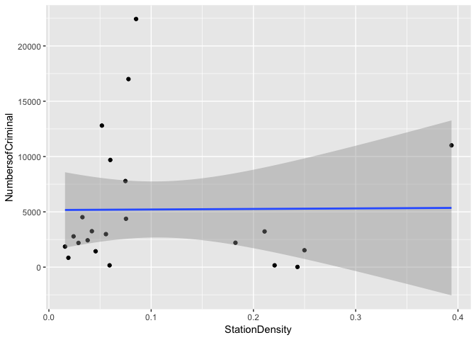

``` r
ggplot(All2,
       aes(x=PeopleDensity,
           y=NumbersofCriminal))+
  geom_point()+
  geom_smooth(method = "glm")
```

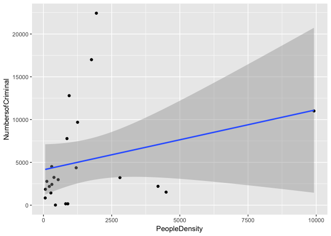

``` r
ggplot(All3,
       aes(x=PeopleDensity,
           y=NumbersofCriminal))+
  geom_point()+
  geom_smooth(method = "glm")
```

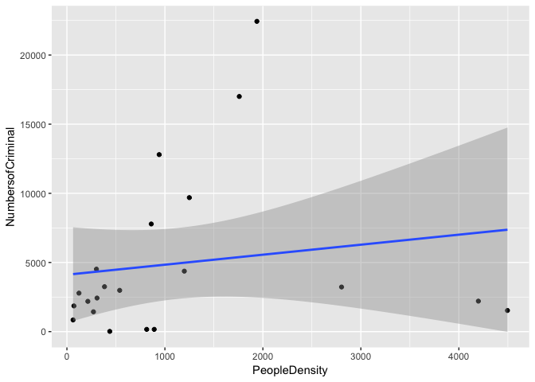

``` r
#台灣各地區案件數量和警察局數量
knitr::kable(P_C_F)
```

| County        |  NumbersofPoliceStation|  NumbersofCriminal|       Rate|
|:--------------|-----------------------:|------------------:|----------:|
| Kaohsiung     |                     153|              12800|  0.1116110|
| Hualien       |                      73|               1859|  0.0162098|
| Keelung       |                      28|               3225|  0.0281207|
| ChiayiCity    |                      15|               1528|  0.0133236|
| ChiayiCounty  |                      87|               1434|  0.0125039|
| Kinmen        |                       9|                163|  0.0014213|
| Lianjiang     |                       7|                 17|  0.0001482|
| Miaoli        |                      69|               2428|  0.0211712|
| Nantou        |                      99|               2783|  0.0242667|
| Penghu        |                      28|                162|  0.0014126|
| Pingtung      |                      91|               4517|  0.0393865|
| Taipei        |                     107|              11012|  0.0960204|
| Taitung       |                      67|                845|  0.0073681|
| Tainan        |                     164|               7784|  0.0678735|
| Taichung      |                     133|               9689|  0.0844843|
| Taoyuan       |                      95|              17003|  0.1482596|
| NewTaipei     |                     175|              22436|  0.1956332|
| HsinchuCity   |                      19|               2205|  0.0192267|
| HsinchuCounty |                      60|               3249|  0.0283300|
| Yilan         |                      62|               2189|  0.0190872|
| Yunlin        |                      72|               2984|  0.0260193|
| Changhua      |                      81|               4372|  0.0381221|

``` r
#台灣警察局經緯度
knitr::kable(policeS_clean)
```

| 中文單位名稱       | 地址   |  POINT\_X|  POINT\_Y|
|:-------------------|:-------|---------:|---------:|
| 臺北市政府警察局   | 台北市 |  25.04387|  121.5098|
| 中山分局           | 台北市 |  25.05259|  121.5228|
| 中山一派出所       | 台北市 |  25.04999|  121.5214|
| 中山二派出所       | 台北市 |  25.05764|  121.5226|
| 圓山派出所         | 台北市 |  25.07271|  121.5237|
| 長春路派出所       | 台北市 |  25.05464|  121.5360|
| 長安東路派出所     | 台北市 |  25.04847|  121.5406|
| 民權一派出所       | 台北市 |  25.05991|  121.5280|
| 建國路派出所       | 台北市 |  25.06800|  121.5360|
| 大直派出所         | 台北市 |  25.07953|  121.5441|
| 大安分局           | 台北市 |  25.03783|  121.5331|
| 羅斯福路派出所     | 台北市 |  25.01114|  121.5380|
| 臥龍街派出所       | 台北市 |  25.01795|  121.5519|
| 敦化南路派出所     | 台北市 |  25.03896|  121.5439|
| 安和路派出所       | 台北市 |  25.03296|  121.5521|
| 瑞安街派出所       | 台北市 |  25.03116|  121.5450|
| 和平東路派出所     | 台北市 |  25.02661|  121.5305|
| 新生南路派出所     | 台北市 |  25.03774|  121.5340|
| 中正一分局         | 台北市 |  25.04517|  121.5174|
| 忠孝西路派出所     | 台北市 |  25.04517|  121.5174|
| 忠孝東路派出所     | 台北市 |  25.04365|  121.5271|
| 仁愛路派出所       | 台北市 |  25.03898|  121.5226|
| 介壽路派出所       | 台北市 |  25.03998|  121.5155|
| 博愛路派出所       | 台北市 |  25.04171|  121.5116|
| 中正二分局         | 台北市 |  25.03209|  121.5140|
| 南海路派出所       | 台北市 |  25.03209|  121.5140|
| 思源街派出所       | 台北市 |  25.01518|  121.5319|
| 南昌路派出所       | 台北市 |  25.03232|  121.5165|
| 泉州街派出所       | 台北市 |  25.02428|  121.5122|
| 廈門街派出所       | 台北市 |  25.02609|  121.5178|
| 文山二分局         | 台北市 |  24.99269|  121.5410|
| 萬盛派出所         | 台北市 |  25.00390|  121.5389|
| 景美派出所         | 台北市 |  24.99269|  121.5410|
| 興隆派出所         | 台北市 |  25.00152|  121.5512|
| 文山一分局         | 台北市 |  24.98873|  121.5637|
| 木新派出所         | 台北市 |  24.98247|  121.5673|
| 指南派出所         | 台北市 |  24.98732|  121.5779|
| 萬芳派出所         | 台北市 |  25.00227|  121.5668|
| 復興派出所         | 台北市 |  24.98676|  121.5470|
| 木柵派出所         | 台北市 |  24.98873|  121.5637|
| 南港分局           | 台北市 |  25.05526|  121.5947|
| 玉成派出所         | 台北市 |  25.05526|  121.5947|
| 舊莊派出所         | 台北市 |  25.03847|  121.6225|
| 同德派出所         | 台北市 |  25.04606|  121.5856|
| 南港派出所         | 台北市 |  25.05493|  121.6072|
| 內湖分局           | 台北市 |  25.06926|  121.5896|
| 康樂派出所         | 台北市 |  25.07036|  121.6184|
| 東湖派出所         | 台北市 |  25.06743|  121.6130|
| 文德派出所         | 台北市 |  25.06660|  121.5789|
| 大湖派出所         | 台北市 |  25.08410|  121.6014|
| 港墘派出所         | 台北市 |  25.07879|  121.5767|
| 西湖派出所         | 台北市 |  25.07912|  121.5693|
| 潭美派出所         | 台北市 |  25.05529|  121.5816|
| 內湖派出所         | 台北市 |  25.08208|  121.5901|
| 康寧派出所         | 台北市 |  25.08117|  121.5975|
| 北投分局           | 台北市 |  25.13337|  121.5013|
| 永明派出所         | 台北市 |  25.11785|  121.5166|
| 竹子湖派出所       | 台北市 |  25.16759|  121.5402|
| 公園派出所         | 台北市 |  25.14880|  121.5486|
| 關渡派出所         | 台北市 |  25.12297|  121.4659|
| 石牌派出所         | 台北市 |  25.10989|  121.5125|
| 奇岩派出所         | 台北市 |  25.12764|  121.5080|
| 大屯派出所         | 台北市 |  25.14560|  121.4932|
| 光明派出所         | 台北市 |  25.13733|  121.5042|
| 長安派出所         | 台北市 |  25.13337|  121.5013|
| 士林分局           | 台北市 |  25.09073|  121.5260|
| 翠山派出所         | 台北市 |  25.10811|  121.5603|
| 後港派出所         | 台北市 |  25.08740|  121.5180|
| 山仔后派出所       | 台北市 |  25.13726|  121.5463|
| 永福派出所         | 台北市 |  25.11838|  121.5523|
| 溪山派出所         | 台北市 |  25.11980|  121.5845|
| 芝山岩派出所       | 台北市 |  25.10111|  121.5379|
| 天母派出所         | 台北市 |  25.12509|  121.5329|
| 蘭雅派出所         | 台北市 |  25.10664|  121.5247|
| 社子派出所         | 台北市 |  25.08922|  121.5046|
| 文林派出所         | 台北市 |  25.09073|  121.5260|
| 信義分局           | 台北市 |  25.03315|  121.5677|
| 六張犁派出所       | 台北市 |  25.02365|  121.5551|
| 吳興街派出所       | 台北市 |  25.02661|  121.5639|
| 福德街派出所       | 台北市 |  25.03856|  121.5761|
| 五分埔派出所       | 台北市 |  25.04566|  121.5758|
| 三張犁派出所       | 台北市 |  25.03315|  121.5677|
| 松山分局           | 台北市 |  25.05155|  121.5477|
| 民有派出所         | 台北市 |  25.06175|  121.5481|
| 三民派出所         | 台北市 |  25.05933|  121.5629|
| 東社派出所         | 台北市 |  25.05672|  121.5514|
| 中崙派出所         | 台北市 |  25.04839|  121.5460|
| 松山派出所         | 台北市 |  25.04984|  121.5772|
| 大同分局           | 台北市 |  25.05934|  121.5150|
| 建成派出所         | 台北市 |  25.05275|  121.5173|
| 民生西路派出所     | 台北市 |  25.05923|  121.5121|
| 延平派出所         | 台北市 |  25.05221|  121.5117|
| 重慶北路派出所     | 台北市 |  25.07545|  121.5135|
| 寧夏路派出所       | 台北市 |  25.05934|  121.5150|
| 民族路派出所       | 台北市 |  25.06879|  121.5135|
| 萬華分局           | 台北市 |  25.04511|  121.5029|
| 青年路派出所       | 台北市 |  25.02192|  121.5021|
| 東園街派出所       | 台北市 |  25.02241|  121.4982|
| 西園路派出所       | 台北市 |  25.02816|  121.4956|
| 莒光派出所         | 台北市 |  25.03108|  121.5027|
| 華江派出所         | 台北市 |  25.03429|  121.4932|
| 大理街派出所       | 台北市 |  25.03445|  121.4983|
| 康定路派出所       | 台北市 |  25.03508|  121.5003|
| 桂林路派出所       | 台北市 |  25.03859|  121.4996|
| 昆明街派出所       | 台北市 |  25.03786|  121.5039|
| 漢中街派出所       | 台北市 |  25.04197|  121.5073|
| 武昌街派出所       | 台北市 |  25.04801|  121.5065|
| 新北市政府警察局   | 新北市 |  25.00986|  121.4585|
| 土城分局           | 新北市 |  24.97328|  121.4429|
| 土城派出所         | 新北市 |  24.97328|  121.4429|
| 金城派出所         | 新北市 |  24.98409|  121.4635|
| 廣福派出所         | 新北市 |  24.98770|  121.4560|
| 清水派出所         | 新北市 |  24.98130|  121.4589|
| 頂埔派出所         | 新北市 |  24.95932|  121.4183|
| 三峽分局           | 新北市 |  24.93055|  121.3752|
| 吉埔派出所         | 新北市 |  24.90649|  121.3623|
| 成福派出所         | 新北市 |  24.92980|  121.4206|
| 圳頭派出所         | 新北市 |  24.90649|  121.3623|
| 五寮派出所         | 新北市 |  24.85813|  121.3593|
| 插角派出所         | 新北市 |  24.87091|  121.4065|
| 湖山派出所         | 新北市 |  24.97304|  121.3462|
| 鳳鳴派出所         | 新北市 |  24.96628|  121.3324|
| 二橋派出所         | 新北市 |  24.94235|  121.3386|
| 橫溪派出所         | 新北市 |  24.93741|  121.3955|
| 鶯歌分駐所         | 新北市 |  24.95725|  121.3535|
| 三峽派出所         | 新北市 |  24.93374|  121.3697|
| 北大派出所         | 新北市 |  24.94419|  121.3778|
| 三重分局           | 新北市 |  25.05915|  121.4900|
| 永福派出所         | 新北市 |  25.07660|  121.4813|
| 中興橋派出所       | 新北市 |  25.05049|  121.4902|
| 光明派出所         | 新北市 |  25.06085|  121.4873|
| 慈福派出所         | 新北市 |  25.08225|  121.4872|
| 厚德派出所         | 新北市 |  25.07343|  121.4921|
| 長泰派出所         | 新北市 |  25.06830|  121.4994|
| 三重派出所         | 新北市 |  25.06397|  121.5023|
| 大同派出所         | 新北市 |  25.05676|  121.4966|
| 二重派出所         | 新北市 |  25.04753|  121.4759|
| 大有派出所         | 新北市 |  25.07027|  121.4756|
| 重陽派出所         | 新北市 |  25.08922|  121.4879|
| 中和分局           | 新北市 |  24.99793|  121.5010|
| 中和派出所         | 新北市 |  24.99969|  121.5023|
| 安平派出所         | 新北市 |  24.99997|  121.5112|
| 秀山派出所         | 新北市 |  24.99047|  121.5260|
| 南勢派出所         | 新北市 |  24.98652|  121.5079|
| 景安派出所         | 新北市 |  24.99048|  121.5027|
| 國光派出所         | 新北市 |  24.99989|  121.4726|
| 錦和派出所         | 新北市 |  24.99366|  121.4956|
| 中原派出所         | 新北市 |  25.00762|  121.4883|
| 積穗派出所         | 新北市 |  25.00482|  121.4801|
| 員山派出所         | 新北市 |  24.99826|  121.4809|
| 板橋分局           | 新北市 |  25.01243|  121.4601|
| 沙崙派出所         | 新北市 |  24.98841|  121.4303|
| 大觀派出所         | 新北市 |  25.00125|  121.4459|
| 後埔派出所         | 新北市 |  25.00473|  121.4609|
| 板橋派出所         | 新北市 |  25.01239|  121.4601|
| 信義派出所         | 新北市 |  24.99141|  121.4612|
| 樹林分局           | 新北市 |  24.99692|  121.4188|
| 柑園派出所         | 新北市 |  24.95424|  121.3879|
| 山佳派出所         | 新北市 |  24.97267|  121.3949|
| 三多派出所         | 新北市 |  25.01632|  121.4047|
| 樹林派出所         | 新北市 |  24.99194|  121.4255|
| 彭厝派出所         | 新北市 |  24.97967|  121.4217|
| 永和分局           | 新北市 |  25.00956|  121.5204|
| 得和派出所         | 新北市 |  24.99707|  121.5201|
| 中正橋派出所       | 新北市 |  25.01639|  121.5158|
| 新生派出所         | 新北市 |  25.01259|  121.5103|
| 秀朗派出所         | 新北市 |  25.00276|  121.5252|
| 永和派出所         | 新北市 |  25.00623|  121.5145|
| 汐止分局           | 新北市 |  25.06817|  121.6602|
| 東山派出所         | 新北市 |  25.06070|  121.6989|
| 烘內派出所         | 新北市 |  25.08844|  121.6468|
| 長青派出所         | 新北市 |  25.11116|  121.6056|
| 橫科派出所         | 新北市 |  25.04766|  121.6192|
| 社后派出所         | 新北市 |  25.06374|  121.6334|
| 長安派出所         | 新北市 |  25.07754|  121.6681|
| 汐止派出所         | 新北市 |  25.06821|  121.6603|
| 淡水分局           | 新北市 |  25.17261|  121.4366|
| 水源派出所         | 新北市 |  25.18584|  121.4781|
| 興仁派出所         | 新北市 |  25.21775|  121.4518|
| 賢孝派出所         | 新北市 |  25.23353|  121.4547|
| 後厝派出所         | 新北市 |  25.25097|  121.4693|
| 興華派出所         | 新北市 |  25.20469|  121.5021|
| 三芝分駐所         | 新北市 |  25.25752|  121.5011|
| 中正路派出所       | 新北市 |  25.17282|  121.4366|
| 中山路派出所       | 新北市 |  25.16522|  121.4498|
| 竹圍派出所         | 新北市 |  25.13744|  121.4598|
| 水碓派出所         | 新北市 |  25.17828|  121.4444|
| 新店分局           | 新北市 |  24.97758|  121.5497|
| 龜山派出所         | 新北市 |  24.90262|  121.5518|
| 福山派出所         | 新北市 |  24.77852|  121.5022|
| 楓子林派出所       | 新北市 |  25.00981|  121.6425|
| 石派出所          | 新北市 |  24.90237|  121.7197|
| 漁光派出所         | 新北市 |  24.96338|  121.7389|
| 孝義派出所         | 新北市 |  24.85091|  121.5854|
| 雙城派出所         | 新北市 |  24.95171|  121.4878|
| 中民派出所         | 新北市 |  25.00820|  121.6729|
| 碧山派出所         | 新北市 |  24.95164|  121.6318|
| 屈尺派出所         | 新北市 |  24.92271|  121.5462|
| 深坑分駐所         | 新北市 |  25.00170|  121.6153|
| 忠治派出所         | 新北市 |  24.88412|  121.5504|
| 石碇分駐所         | 新北市 |  25.00981|  121.6425|
| 信賢派出所         | 新北市 |  24.83824|  121.5262|
| 坪林分駐所         | 新北市 |  24.93570|  121.7115|
| 青潭派出所         | 新北市 |  24.95458|  121.5600|
| 烏來分駐所         | 新北市 |  24.86477|  121.5520|
| 闊瀨派出所         | 新北市 |  24.96562|  121.7712|
| 安康派出所         | 新北市 |  24.96368|  121.5145|
| 豐田派出所         | 新北市 |  24.97404|  121.6873|
| 頂城派出所         | 新北市 |  24.95701|  121.5343|
| 直潭派出所         | 新北市 |  24.93851|  121.5345|
| 江陵派出所         | 新北市 |  24.97867|  121.5419|
| 金溪派出所         | 新北市 |  24.91125|  121.6791|
| 碧潭派出所         | 新北市 |  24.96283|  121.5394|
| 安和派出所         | 新北市 |  24.97986|  121.5175|
| 新莊分局           | 新北市 |  25.03614|  121.4515|
| 丹鳳派出所         | 新北市 |  25.02762|  121.4149|
| 文化派出所         | 新北市 |  25.07203|  121.3764|
| 下福派出所         | 新北市 |  25.11737|  121.2909|
| 瑞平派出所         | 新北市 |  25.12265|  121.3358|
| 林口分駐所         | 新北市 |  25.07733|  121.3938|
| 泰山分駐所         | 新北市 |  25.06167|  121.4331|
| 光華派出所         | 新北市 |  25.01704|  121.4264|
| 明志派出所         | 新北市 |  25.04380|  121.4248|
| 福營派出所         | 新北市 |  25.02863|  121.4330|
| 頭前派出所         | 新北市 |  25.04825|  121.4658|
| 中港派出所         | 新北市 |  25.04667|  121.4520|
| 新莊派出所         | 新北市 |  25.03458|  121.4532|
| 中平派出所         | 新北市 |  25.05123|  121.4449|
| 忠孝派出所         | 新北市 |  25.07011|  121.3636|
| 瑞芳分局           | 新北市 |  25.10761|  121.8077|
| 九份派出所         | 新北市 |  25.10962|  121.8432|
| 吉林派出所         | 新北市 |  25.00223|  121.8862|
| 四腳亭派出所       | 新北市 |  25.10422|  121.7620|
| 金瓜石派出所       | 新北市 |  25.10832|  121.8578|
| 牡丹派出所         | 新北市 |  25.06013|  121.8499|
| 澳底派出所         | 新北市 |  25.05640|  121.9246|
| 東勢格派出所       | 新北市 |  25.00511|  121.7497|
| 柑腳派出所         | 新北市 |  25.01822|  121.8089|
| 福隆派出所         | 新北市 |  25.01650|  121.9448|
| 鼻頭派出所         | 新北市 |  25.12375|  121.9161|
| 瑞濱派出所         | 新北市 |  25.12100|  121.8196|
| 猴硐派出所         | 新北市 |  25.09284|  121.8329|
| 大寮派出所         | 新北市 |  25.10688|  121.7874|
| 卯澳派出所         | 新北市 |  25.01292|  121.9879|
| 和美派出所         | 新北市 |  25.08296|  121.9136|
| 太平派出所         | 新北市 |  24.97155|  121.8258|
| 貢寮分駐所         | 新北市 |  25.02193|  121.9100|
| 十分派出所         | 新北市 |  25.04563|  121.7788|
| 平溪分駐所         | 新北市 |  25.02332|  121.7225|
| 平林派出所         | 新北市 |  25.03024|  121.8331|
| 雙溪分駐所         | 新北市 |  25.03585|  121.8653|
| 水湳洞派出所       | 新北市 |  25.12162|  121.8619|
| 瑞芳派出所         | 新北市 |  25.10761|  121.8077|
| 蘆洲分局           | 新北市 |  25.09353|  121.4602|
| 延平派出所         | 新北市 |  25.08175|  121.4615|
| 更寮派出所         | 新北市 |  25.07792|  121.4584|
| 成州派出所         | 新北市 |  25.10147|  121.4516|
| 龍源派出所         | 新北市 |  25.13229|  121.4513|
| 五股分駐所         | 新北市 |  25.08351|  121.4368|
| 八里分駐所         | 新北市 |  25.14597|  121.3975|
| 三民派出所         | 新北市 |  25.09353|  121.4602|
| 蘆洲派出所         | 新北市 |  25.08196|  121.4727|
| 五工派出所         | 新北市 |  25.06330|  121.4577|
| 德音派出所         | 新北市 |  25.07128|  121.4305|
| 集賢派出所         | 新北市 |  25.08497|  121.4817|
| 金山分局           | 新北市 |  25.22034|  121.6407|
| 中角派出所         | 新北市 |  25.26355|  121.6307|
| 崁腳派出所         | 新北市 |  25.16040|  121.6508|
| 重光派出所         | 新北市 |  25.21595|  121.6037|
| 乾華派出所         | 新北市 |  25.27980|  121.6084|
| 野柳派出所         | 新北市 |  25.20381|  121.6850|
| 老梅派出所         | 新北市 |  25.28899|  121.5456|
| 大鵬派出所         | 新北市 |  25.21244|  121.6467|
| 石門分駐所         | 新北市 |  25.29081|  121.5674|
| 金山派出所         | 新北市 |  25.22034|  121.6407|
| 萬里分駐所         | 新北市 |  25.17802|  121.6896|
| 海山分局           | 新北市 |  25.01151|  121.4700|
| 海山派出所         | 新北市 |  25.01151|  121.4700|
| 新海派出所         | 新北市 |  25.02404|  121.4600|
| 埔墘派出所         | 新北市 |  25.01871|  121.4796|
| 江翠派出所         | 新北市 |  25.03030|  121.4699|
| 文聖派出所         | 新北市 |  25.02686|  121.4774|
| 桃園市政府警察局   | 桃園市 |  24.99336|  121.3020|
| 桃園分局           | 桃園市 |  25.00023|  121.2990|
| 大樹派出所         | 桃園市 |  24.97799|  121.3202|
| 埔子派出所         | 桃園市 |  25.00022|  121.2990|
| 青溪派出所         | 桃園市 |  24.99810|  121.3143|
| 中路派出所         | 桃園市 |  24.99324|  121.2997|
| 景福派出所         | 桃園市 |  24.99264|  121.3091|
| 武陵派出所         | 桃園市 |  24.99008|  121.3124|
| 同安派出所         | 桃園市 |  25.01436|  121.3054|
| 龍安派出所         | 桃園市 |  24.99063|  121.2810|
| 大園分局           | 桃園市 |  25.06345|  121.1959|
| 潮音派出所         | 桃園市 |  25.08108|  121.1713|
| 觀音分駐所         | 桃園市 |  25.03646|  121.0822|
| 草漯派出所         | 桃園市 |  25.04726|  121.1430|
| 新坡派出所         | 桃園市 |  25.01263|  121.1362|
| 竹圍派出所         | 桃園市 |  25.10397|  121.2438|
| 埔心派出所         | 桃園市 |  25.05432|  121.2243|
| 大園派出所         | 桃園市 |  25.06345|  121.1959|
| 三派出所          | 桃園市 |  25.07318|  121.2572|
| 蘆竹分局           | 桃園市 |  25.04724|  121.2932|
| 南崁派出所         | 桃園市 |  25.04742|  121.2937|
| 大竹派出所         | 桃園市 |  25.02420|  121.2595|
| 南竹派出所         | 桃園市 |  25.04137|  121.2848|
| 外社派出所         | 桃園市 |  25.08349|  121.3042|
| 大溪分局           | 桃園市 |  24.88021|  121.2871|
| 復興分駐所         | 桃園市 |  24.81418|  121.3510|
| 羅浮派出所         | 桃園市 |  24.79937|  121.3657|
| 榮華派出所         | 桃園市 |  24.73921|  121.3476|
| 巴陵派出所         | 桃園市 |  24.68598|  121.3986|
| 奎輝派出所         | 桃園市 |  24.79597|  121.3351|
| 三光派出所         | 桃園市 |  24.67237|  121.3673|
| 光華派出所         | 桃園市 |  24.65541|  121.3992|
| 霞雲派出所         | 桃園市 |  24.81661|  121.3839|
| 長興派出所         | 桃園市 |  24.79964|  121.3071|
| 溪內派出所         | 桃園市 |  24.80339|  121.3680|
| 三元派出所         | 桃園市 |  24.88063|  121.2653|
| 圳頂派出所         | 桃園市 |  24.90499|  121.2838|
| 內柵派出所         | 桃園市 |  24.85935|  121.2812|
| 中新派出所         | 桃園市 |  24.93039|  121.3185|
| 百吉派出所         | 桃園市 |  24.82514|  121.3093|
| 三民派出所         | 桃園市 |  24.83228|  121.3310|
| 三層派出所         | 桃園市 |  24.84923|  121.2866|
| 永福派出所         | 桃園市 |  24.89420|  121.3241|
| 南雅派出所         | 桃園市 |  24.87966|  121.2887|
| 福安派出所         | 桃園市 |  24.84926|  121.2865|
| 慈湖分駐所         | 桃園市 |  24.83981|  121.2928|
| 中壢分局           | 桃園市 |  24.95409|  121.2224|
| 文化派出所         | 桃園市 |  24.97899|  121.2453|
| 仁愛派出所         | 桃園市 |  24.95386|  121.2615|
| 興國派出所         | 桃園市 |  24.96059|  121.2087|
| 龍興派出所         | 桃園市 |  24.93849|  121.2345|
| 大崙派出所         | 桃園市 |  24.98972|  121.1790|
| 中福派出所         | 桃園市 |  24.97181|  121.2334|
| 內壢派出所         | 桃園市 |  24.97221|  121.2557|
| 普仁派出所         | 桃園市 |  24.95404|  121.2388|
| 中壢派出所         | 桃園市 |  24.95409|  121.2224|
| 自強派出所         | 桃園市 |  24.96153|  121.2620|
| 青埔派出所         | 桃園市 |  25.01365|  121.2108|
| 楊梅分局           | 桃園市 |  24.90681|  121.1461|
| 埔頂派出所         | 桃園市 |  24.94955|  121.1187|
| 幼獅派出所         | 桃園市 |  24.92661|  121.1746|
| 上湖派出所         | 桃園市 |  24.91263|  121.0949|
| 新屋分駐所         | 桃園市 |  24.97241|  121.1065|
| 永安派出所         | 桃園市 |  24.98757|  121.0448|
| 大坡派出所         | 桃園市 |  24.95906|  121.0386|
| 富岡派出所         | 桃園市 |  24.93554|  121.0818|
| 草湳派出所         | 桃園市 |  24.91861|  121.1836|
| 楊梅派出所         | 桃園市 |  24.90681|  121.1461|
| 平鎮分局           | 桃園市 |  24.91308|  121.2075|
| 北勢派出所         | 桃園市 |  24.94193|  121.2208|
| 宋屋派出所         | 桃園市 |  24.94268|  121.2062|
| 平鎮派出所         | 桃園市 |  24.91308|  121.2075|
| 建安派出所         | 桃園市 |  24.90918|  121.2311|
| 龍岡派出所         | 桃園市 |  24.92391|  121.2473|
| 龜山分局           | 桃園市 |  24.99531|  121.3389|
| 龜山派出所         | 桃園市 |  24.99531|  121.3389|
| 大林派出所         | 桃園市 |  24.98897|  121.3323|
| 大坑派出所         | 桃園市 |  25.04512|  121.3153|
| 大埔派出所         | 桃園市 |  25.05333|  121.3817|
| 迴龍派出所         | 桃園市 |  25.01909|  121.4054|
| 坪頂派出所         | 桃園市 |  25.05549|  121.3569|
| 大華派出所         | 桃園市 |  25.05187|  121.3655|
| 八德分局           | 桃園市 |  24.93824|  121.3091|
| 八德派出所         | 桃園市 |  24.92966|  121.2848|
| 廣興派出所         | 桃園市 |  24.95018|  121.2838|
| 四維派出所         | 桃園市 |  24.95592|  121.3028|
| 高明派出所         | 桃園市 |  24.96479|  121.2787|
| 大安派出所         | 桃園市 |  24.97039|  121.3248|
| 龍潭分局           | 桃園市 |  24.86867|  121.2075|
| 三和派出所         | 桃園市 |  24.85045|  121.1751|
| 高平派出所         | 桃園市 |  24.83582|  121.2070|
| 石門派出所         | 桃園市 |  24.84271|  121.2413|
| 中興派出所         | 桃園市 |  24.87262|  121.2343|
| 龍潭派出所         | 桃園市 |  24.87023|  121.2203|
| 聖亭派出所         | 桃園市 |  24.86867|  121.2075|
| 新竹縣政府警察局   | 新竹縣 |  24.82693|  121.0113|
| 竹東分局           | 新竹縣 |  24.73737|  121.0867|
| 竹東派出所         | 新竹縣 |  24.73737|  121.0867|
| 五峰分駐所         | 新竹縣 |  24.63176|  121.1198|
| 羅山派出所         | 新竹縣 |  24.62475|  121.1478|
| 茅圃派出所         | 新竹縣 |  24.61585|  121.1031|
| 清泉派出所         | 新竹縣 |  24.57334|  121.1036|
| 桃山派出所         | 新竹縣 |  24.59646|  121.1089|
| 雲山派出所         | 新竹縣 |  24.56524|  121.0898|
| 花園派出所         | 新竹縣 |  24.64604|  121.1511|
| 寶山分駐所         | 新竹縣 |  24.76543|  120.9909|
| 上坪派出所         | 新竹縣 |  24.66408|  121.1205|
| 新城派出所         | 新竹縣 |  24.73283|  120.9663|
| 楓橋派出所         | 新竹縣 |  24.73364|  121.0280|
| 富興派出所         | 新竹縣 |  24.68689|  120.9879|
| 二重埔派出所       | 新竹縣 |  24.76617|  121.0569|
| 北埔分駐所         | 新竹縣 |  24.69897|  121.0571|
| 峨眉分駐所         | 新竹縣 |  24.68820|  121.0217|
| 下公館派出所       | 新竹縣 |  24.72341|  121.0985|
| 竹北分局           | 新竹縣 |  24.82910|  121.0034|
| 豐田派出所         | 新竹縣 |  24.84270|  120.9641|
| 鳳岡派出所         | 新竹縣 |  24.86106|  120.9635|
| 六家派出所         | 新竹縣 |  24.82237|  121.0300|
| 竹北派出所         | 新竹縣 |  24.83839|  121.0050|
| 三民派出所         | 新竹縣 |  24.83351|  121.0111|
| 山崎派出所         | 新竹縣 |  24.86814|  120.9933|
| 新豐分駐所         | 新竹縣 |  24.90082|  120.9871|
| 後湖派出所         | 新竹縣 |  24.93212|  121.0088|
| 湖口分駐所         | 新竹縣 |  24.89627|  121.0480|
| 湖鏡派出所         | 新竹縣 |  24.87801|  121.0588|
| 新工派出所         | 新竹縣 |  24.87163|  121.0170|
| 高鐵派出所         | 新竹縣 |  24.80502|  121.0382|
| 橫山分局           | 新竹縣 |  24.71637|  121.1416|
| 橫山派出所         | 新竹縣 |  24.71638|  121.1416|
| 芎林分駐所         | 新竹縣 |  24.77490|  121.0810|
| 秀湖派出所         | 新竹縣 |  24.73410|  121.1170|
| 新樂派出所         | 新竹縣 |  24.73249|  121.2513|
| 橫村派出所         | 新竹縣 |  24.71846|  121.1180|
| 玉峰派出所         | 新竹縣 |  24.66005|  121.3007|
| 宇老派出所         | 新竹縣 |  24.66766|  121.2819|
| 秀巒派出所         | 新竹縣 |  24.61794|  121.2855|
| 內灣派出所         | 新竹縣 |  24.70625|  121.1825|
| 那羅派出所         | 新竹縣 |  24.67927|  121.2436|
| 沙坑派出所         | 新竹縣 |  24.73672|  121.1628|
| 梅花派出所         | 新竹縣 |  24.67810|  121.2084|
| 尖石分駐所         | 新竹縣 |  24.70540|  121.2012|
| 嘉樂派出所         | 新竹縣 |  24.70540|  121.2012|
| 泰崗派出所         | 新竹縣 |  24.61167|  121.2963|
| 新埔分局           | 新竹縣 |  24.82764|  121.0743|
| 新埔派出所         | 新竹縣 |  24.82764|  121.0743|
| 錦山派出所         | 新竹縣 |  24.77202|  121.2318|
| 玉山派出所         | 新竹縣 |  24.77202|  121.2318|
| 東安派出所         | 新竹縣 |  24.79013|  121.1823|
| 南華派出所         | 新竹縣 |  24.79013|  121.1823|
| 關西分駐所         | 新竹縣 |  24.79224|  121.1726|
| 褒忠派出所         | 新竹縣 |  24.84316|  121.0359|
| 寶石派出所         | 新竹縣 |  24.81642|  121.0777|
| 照門派出所         | 新竹縣 |  24.84707|  121.1155|
| 石光派出所         | 新竹縣 |  24.81397|  121.1284|
| 坪林派出所         | 新竹縣 |  24.81397|  121.1284|
| 新竹市警察局       | 新竹市 |  24.80637|  120.9685|
| 第一分局           | 新竹市 |  24.81031|  120.9555|
| 湳雅派出所         | 新竹市 |  24.81961|  120.9730|
| 樹林頭派出所       | 新竹市 |  24.81031|  120.9555|
| 南寮派出所         | 新竹市 |  24.84040|  120.9375|
| 北門派出所         | 新竹市 |  24.80803|  120.9651|
| 西門派出所         | 新竹市 |  24.80197|  120.9612|
| 第二分局           | 新竹市 |  24.80121|  120.9865|
| 文華派出所         | 新竹市 |  24.81468|  120.9771|
| 關東橋派出所       | 新竹市 |  24.77891|  121.0189|
| 埔頂派出所         | 新竹市 |  24.78903|  121.0079|
| 東勢派出所         | 新竹市 |  24.80149|  120.9866|
| 東門派出所         | 新竹市 |  24.80412|  120.9698|
| 第三分局           | 新竹市 |  24.79763|  120.9426|
| 中華派出所         | 新竹市 |  24.79168|  120.9262|
| 青草湖派出所       | 新竹市 |  24.77405|  120.9664|
| 朝山派出所         | 新竹市 |  24.76625|  120.9147|
| 香山派出所         | 新竹市 |  24.79763|  120.9426|
| 南門派出所         | 新竹市 |  24.80016|  120.9678|
| 苗栗縣警察局       | 苗栗縣 |  24.56392|  120.8201|
| 苗栗分局           | 苗栗縣 |  24.54173|  120.8210|
| 明德派出所         | 苗栗縣 |  24.58465|  120.8845|
| 鯉魚派出所         | 苗栗縣 |  24.34975|  120.7431|
| 福基派出所         | 苗栗縣 |  24.47224|  120.8307|
| 龍騰派出所         | 苗栗縣 |  24.37856|  120.7496|
| 雞隆派出所         | 苗栗縣 |  24.42893|  120.8084|
| 鶴岡派出所         | 苗栗縣 |  24.53196|  120.8321|
| 頭屋分駐所         | 苗栗縣 |  24.57696|  120.8506|
| 銅鑼分駐所         | 苗栗縣 |  24.48705|  120.7872|
| 文山派出所         | 苗栗縣 |  24.56595|  120.8105|
| 公館分駐所         | 苗栗縣 |  24.50365|  120.8271|
| 北苗派出所         | 苗栗縣 |  24.57145|  120.8285|
| 南苗派出所         | 苗栗縣 |  24.55085|  120.8144|
| 三義分駐所         | 苗栗縣 |  24.41278|  120.7698|
| 竹南分局           | 苗栗縣 |  24.68515|  120.8785|
| 大山派出所         | 苗栗縣 |  24.64853|  120.8110|
| 外埔派出所         | 苗栗縣 |  24.61363|  120.7863|
| 中港海口派出所     | 苗栗縣 |  24.67523|  120.8645|
| 聯港派出所         | 苗栗縣 |  24.61239|  120.7602|
| 談文派出所         | 苗栗縣 |  24.65377|  120.8520|
| 新港派出所         | 苗栗縣 |  24.61129|  120.8133|
| 南勢派出所         | 苗栗縣 |  24.57448|  120.7354|
| 造橋分駐所         | 苗栗縣 |  24.64198|  120.8668|
| 竹南派出所         | 苗栗縣 |  24.68515|  120.8785|
| 後龍分駐所         | 苗栗縣 |  24.61363|  120.7863|
| 大同派出所         | 苗栗縣 |  24.70947|  120.8969|
| 大湖分局           | 苗栗縣 |  24.42288|  120.8663|
| 坪林派出所         | 苗栗縣 |  24.33440|  120.8748|
| 百壽派出所         | 苗栗縣 |  24.57948|  120.9410|
| 觀霧派出所         | 苗栗縣 |  24.50639|  121.1137|
| 大興派出所         | 苗栗縣 |  24.42132|  120.9108|
| 泰安分駐所         | 苗栗縣 |  24.44660|  120.9054|
| 汶水派出所         | 苗栗縣 |  24.45769|  120.8759|
| 獅潭分駐所         | 苗栗縣 |  24.54151|  120.9221|
| 龍山派出所         | 苗栗縣 |  24.46979|  120.9685|
| 八卦派出所         | 苗栗縣 |  24.46979|  120.9685|
| 大湖派出所         | 苗栗縣 |  24.42288|  120.8663|
| 和興派出所         | 苗栗縣 |  24.51459|  120.9105|
| 大安派出所         | 苗栗縣 |  24.36002|  120.9488|
| 校林派出所         | 苗栗縣 |  24.37327|  120.8425|
| 南湖派出所         | 苗栗縣 |  24.40146|  120.8673|
| 梅園派出所         | 苗栗縣 |  24.39306|  120.9790|
| 卓蘭分駐所         | 苗栗縣 |  24.31271|  120.8256|
| 象鼻派出所         | 苗栗縣 |  24.36052|  120.9482|
| 中興派出所         | 苗栗縣 |  24.39404|  120.9203|
| 通霄分局           | 苗栗縣 |  24.49077|  120.6822|
| 埔口派出所         | 苗栗縣 |  24.51266|  120.6910|
| 中和派出所         | 苗栗縣 |  24.44683|  120.7216|
| 白沙派出所         | 苗栗縣 |  24.56441|  120.7107|
| 高湖派出所         | 苗栗縣 |  24.52261|  120.7760|
| 通霄派出所         | 苗栗縣 |  24.49077|  120.6822|
| 苑裡分駐所         | 苗栗縣 |  24.44375|  120.6533|
| 西湖分駐所         | 苗栗縣 |  24.55862|  120.7578|
| 社苓派出所         | 苗栗縣 |  24.38941|  120.6849|
| 烏眉派出所         | 苗栗縣 |  24.50888|  120.7226|
| 山腳派出所         | 苗栗縣 |  24.41723|  120.6862|
| 頭份分局           | 苗栗縣 |  24.69396|  120.9059|
| 頭份派出所         | 苗栗縣 |  24.69396|  120.9059|
| 大河派出所         | 苗栗縣 |  24.61806|  120.9488|
| 蓬萊派出所         | 苗栗縣 |  24.54401|  120.9717|
| 東河派出所         | 苗栗縣 |  24.59912|  121.0423|
| 田美派出所         | 苗栗縣 |  24.62909|  121.0116|
| 陸家派出所         | 苗栗縣 |  24.53872|  121.0274|
| 南埔派出所         | 苗栗縣 |  24.63543|  120.9789|
| 斗坪派出所         | 苗栗縣 |  24.68076|  120.9463|
| 尖山派出所         | 苗栗縣 |  24.66456|  120.8814|
| 南庄分駐所         | 苗栗縣 |  24.59773|  120.9989|
| 三灣分駐所         | 苗栗縣 |  24.65501|  120.9569|
| 臺中市政府警察局   | 台中市 |  24.15958|  120.6483|
| 第一分局           | 台中市 |  24.13827|  120.6758|
| 西區分駐所         | 台中市 |  24.13827|  120.6758|
| 公益派出所         | 台中市 |  24.14582|  120.6565|
| 民權派出所         | 台中市 |  24.14622|  120.6708|
| 大誠分駐所         | 台中市 |  24.14399|  120.6795|
| 繼中派出所         | 台中市 |  24.13732|  120.6838|
| 第二分局           | 台中市 |  24.16498|  120.6822|
| 永興派出所         | 台中市 |  24.16498|  120.6822|
| 立人派出所         | 台中市 |  24.16985|  120.6684|
| 育才派出所         | 台中市 |  24.15046|  120.6846|
| 文正派出所         | 台中市 |  24.14700|  120.6747|
| 公園派出所         | 台中市 |  24.14411|  120.6856|
| 第三分局           | 台中市 |  24.13069|  120.6735|
| 東區分駐所         | 台中市 |  24.14131|  120.6945|
| 合作派出所         | 台中市 |  24.15182|  120.6929|
| 立德派出所         | 台中市 |  24.13576|  120.6899|
| 勤工派出所         | 台中市 |  24.11223|  120.6507|
| 健康派出所         | 台中市 |  24.11967|  120.6671|
| 正義派出所         | 台中市 |  24.13072|  120.6735|
| 第四分局           | 台中市 |  24.13422|  120.6434|
| 黎明派出所         | 台中市 |  24.15590|  120.6340|
| 春社派出所         | 台中市 |  24.13587|  120.6115|
| 南屯派出所         | 台中市 |  24.13952|  120.6383|
| 大墩派出所         | 台中市 |  24.14199|  120.6497|
| 第五分局           | 台中市 |  24.18201|  120.6865|
| 文昌派出所         | 台中市 |  24.17040|  120.6807|
| 東山派出所         | 台中市 |  24.17905|  120.7403|
| 四平派出所         | 台中市 |  24.19259|  120.6821|
| 水湳派出所         | 台中市 |  24.17847|  120.6682|
| 北屯派出所         | 台中市 |  24.16387|  120.6938|
| 松安派出所         | 台中市 |  24.18235|  120.6999|
| 第六分局           | 台中市 |  24.15950|  120.6390|
| 市政派出所         | 台中市 |  24.15950|  120.6390|
| 西屯派出所         | 台中市 |  24.18106|  120.6380|
| 何安派出所         | 台中市 |  24.16623|  120.6591|
| 協和派出所         | 台中市 |  24.18387|  120.6089|
| 工業區派出所       | 台中市 |  24.16877|  120.6079|
| 永福派出所         | 台中市 |  24.18461|  120.6196|
| 大甲分局           | 台中市 |  24.34539|  120.6267|
| 大甲派出所         | 台中市 |  24.34539|  120.6267|
| 安定派出所         | 台中市 |  24.34525|  120.7042|
| 日南派出所         | 台中市 |  24.37927|  120.6535|
| 月眉派出所         | 台中市 |  24.31340|  120.6922|
| 西岐派出所         | 台中市 |  24.42001|  120.6288|
| 泰安派出所         | 台中市 |  24.32419|  120.7518|
| 海墘派出所         | 台中市 |  24.37953|  120.5867|
| 義里派出所         | 台中市 |  24.30483|  120.7217|
| 后里分駐所         | 台中市 |  24.30517|  120.7102|
| 外埔分駐所         | 台中市 |  24.33229|  120.6554|
| 大安分駐所         | 台中市 |  24.34627|  120.5878|
| 和平分局           | 台中市 |  24.17510|  120.8841|
| 天輪派出所         | 台中市 |  24.18168|  120.9269|
| 德基派出所         | 台中市 |  24.25753|  121.2090|
| 環山派出所         | 台中市 |  24.31373|  121.2954|
| 雙崎派出所         | 台中市 |  24.29203|  120.9093|
| 桃山派出所         | 台中市 |  24.33987|  120.9359|
| 大棟派出所         | 台中市 |  24.24100|  120.9072|
| 勝光派出所         | 台中市 |  24.36859|  121.3387|
| 志良派出所         | 台中市 |  24.34053|  121.3128|
| 竹林派出所         | 台中市 |  24.30514|  120.9246|
| 梨山分駐所         | 台中市 |  24.25434|  121.2467|
| 松茂派出所         | 台中市 |  24.28709|  121.2648|
| 和平派出所         | 台中市 |  24.16920|  120.8696|
| 谷關派出所         | 台中市 |  24.20297|  121.0066|
| 雪山派出所         | 台中市 |  24.26743|  121.0202|
| 烏日分局           | 台中市 |  24.10605|  120.6228|
| 烏日派出所         | 台中市 |  24.10605|  120.6228|
| 龍津派出所         | 台中市 |  24.20111|  120.5227|
| 五光派出所         | 台中市 |  24.09255|  120.6478|
| 龍井分駐所         | 台中市 |  24.19177|  120.5457|
| 溪南派出所         | 台中市 |  24.05645|  120.6462|
| 龍東派出所         | 台中市 |  24.17866|  120.5304|
| 麗水派出所         | 台中市 |  24.19787|  120.5146|
| 犁份派出所         | 台中市 |  24.18263|  120.5840|
| 追分派出所         | 台中市 |  24.12145|  120.5703|
| 大肚分駐所         | 台中市 |  24.15501|  120.5444|
| 瑞井派出所         | 台中市 |  24.15270|  120.5725|
| 三和派出所         | 台中市 |  24.10800|  120.6029|
| 東勢分局           | 台中市 |  24.25841|  120.8279|
| 東勢派出所         | 台中市 |  24.25841|  120.8279|
| 茅埔派出所         | 台中市 |  24.21939|  120.8378|
| 東興派出所         | 台中市 |  24.20692|  120.8212|
| 土牛派出所         | 台中市 |  24.26003|  120.8162|
| 中坑派出所         | 台中市 |  24.23629|  120.8543|
| 永源派出所         | 台中市 |  24.21936|  120.7922|
| 石城派出所         | 台中市 |  24.28509|  120.7892|
| 福中派出所         | 台中市 |  24.15917|  120.8649|
| 石岡分駐所         | 台中市 |  24.27479|  120.7810|
| 新社分駐所         | 台中市 |  24.23408|  120.8100|
| 清水分局           | 台中市 |  24.26926|  120.5741|
| 清水派出所         | 台中市 |  24.26926|  120.5741|
| 大楊派出所         | 台中市 |  24.27319|  120.6313|
| 大秀派出所         | 台中市 |  24.28030|  120.5537|
| 安寧派出所         | 台中市 |  24.24959|  120.5384|
| 高美派出所         | 台中市 |  24.31136|  120.5625|
| 明秀派出所         | 台中市 |  24.21598|  120.5713|
| 光華派出所         | 台中市 |  24.24421|  120.5677|
| 清泉派出所         | 台中市 |  24.24603|  120.6099|
| 梧棲分駐所         | 台中市 |  24.25486|  120.5338|
| 沙鹿分駐所         | 台中市 |  24.23454|  120.5664|
| 三田派出所         | 台中市 |  24.29299|  120.5882|
| 豐原分局           | 台中市 |  24.24368|  120.7136|
| 豐洲派出所         | 台中市 |  24.26197|  120.7035|
| 頭家派出所         | 台中市 |  24.19287|  120.7002|
| 潭北派出所         | 台中市 |  24.21478|  120.7067|
| 合作派出所         | 台中市 |  24.24296|  120.7161|
| 馬岡派出所         | 台中市 |  24.21613|  120.6673|
| 豐東派出所         | 台中市 |  24.24862|  120.7305|
| 社口派出所         | 台中市 |  24.25921|  120.6604|
| 翁子派出所         | 台中市 |  24.26069|  120.7366|
| 神岡分駐所         | 台中市 |  24.25661|  120.6588|
| 大雅分駐所         | 台中市 |  24.22378|  120.6480|
| 潭子分駐所         | 台中市 |  24.20975|  120.7047|
| 頂街派出所         | 台中市 |  24.25488|  120.7232|
| 豐原派出所         | 台中市 |  24.24886|  120.7142|
| 霧峰分局           | 台中市 |  24.07530|  120.7002|
| 國光派出所         | 台中市 |  24.10696|  120.6795|
| 十九甲派出所       | 台中市 |  24.10232|  120.7002|
| 霧峰派出所         | 台中市 |  24.06687|  120.7004|
| 萬豐派出所         | 台中市 |  24.02623|  120.6966|
| 大里分駐所         | 台中市 |  24.09799|  120.6769|
| 吉峰派出所         | 台中市 |  24.07530|  120.7002|
| 內新派出所         | 台中市 |  24.11515|  120.6898|
| 成功派出所         | 台中市 |  24.08483|  120.6977|
| 仁化派出所         | 台中市 |  24.09464|  120.7154|
| 四德派出所         | 台中市 |  24.06017|  120.6661|
| 太平分局           | 台中市 |  24.14222|  120.7324|
| 太平派出所         | 台中市 |  24.12987|  120.7194|
| 新平派出所         | 台中市 |  24.14958|  120.7141|
| 宏龍派出所         | 台中市 |  24.10949|  120.7302|
| 頭汴派出所         | 台中市 |  24.12366|  120.7506|
| 坪林派出所         | 台中市 |  24.14222|  120.7324|
| 南投縣政府警察局   | 南投縣 |  23.90976|  120.6786|
| 南投分局           | 南投縣 |  23.91015|  120.6832|
| 南投派出所         | 南投縣 |  23.91015|  120.6832|
| 永和派出所         | 南投縣 |  23.87429|  120.6541|
| 赤水派出所         | 南投縣 |  23.85724|  120.6294|
| 崁峰派出所         | 南投縣 |  23.83533|  120.6612|
| 名間分駐所         | 南投縣 |  23.83770|  120.7037|
| 新佳派出所         | 南投縣 |  23.87853|  120.6936|
| 鳳鳴派出所         | 南投縣 |  23.92606|  120.6380|
| 半山派出所         | 南投縣 |  23.92159|  120.6762|
| 中興分局           | 南投縣 |  23.95040|  120.6936|
| 中興派出所         | 南投縣 |  23.95040|  120.6936|
| 永清派出所         | 南投縣 |  23.94142|  120.6787|
| 光明派出所         | 南投縣 |  23.93886|  120.6975|
| 府西派出所         | 南投縣 |  23.95787|  120.6851|
| 仁愛分局           | 南投縣 |  24.02333|  121.1324|
| 霧社派出所         | 南投縣 |  24.02333|  121.1324|
| 翠巒派出所         | 南投縣 |  24.18271|  121.2036|
| 親愛派出所         | 南投縣 |  23.96829|  121.1083|
| 春陽派出所         | 南投縣 |  24.02782|  121.1491|
| 中原派出所         | 南投縣 |  24.06319|  120.9688|
| 眉原派出所         | 南投縣 |  24.06319|  120.9688|
| 清流派出所         | 南投縣 |  24.06319|  120.9688|
| 瑞岩派出所         | 南投縣 |  24.11578|  121.1613|
| 南豐派出所         | 南投縣 |  24.00338|  121.0656|
| 榮興派出所         | 南投縣 |  24.22319|  121.2895|
| 過坑派出所         | 南投縣 |  23.90509|  120.9918|
| 平靜派出所         | 南投縣 |  24.06014|  121.1922|
| 靜觀派出所         | 南投縣 |  24.06014|  121.1922|
| 紅香派出所         | 南投縣 |  24.16036|  121.1766|
| 松岡派出所         | 南投縣 |  24.02319|  121.1328|
| 華崗派出所         | 南投縣 |  24.19718|  121.2300|
| 望洋派出所         | 南投縣 |  24.14786|  121.1893|
| 廬山派出所         | 南投縣 |  24.02249|  121.1881|
| 武界派出所         | 南投縣 |  23.91694|  121.0460|
| 萬豐派出所         | 南投縣 |  23.91694|  121.0460|
| 翠峰派出所         | 南投縣 |  24.10540|  121.1971|
| 信義分局           | 南投縣 |  23.69717|  120.8543|
| 信義派出所         | 南投縣 |  23.69717|  120.8543|
| 久美派出所         | 南投縣 |  23.61904|  120.8841|
| 潭南派出所         | 南投縣 |  23.82161|  120.9397|
| 豐丘派出所         | 南投縣 |  23.67062|  120.8752|
| 新鄉派出所         | 南投縣 |  23.64028|  120.8690|
| 東埔派出所         | 南投縣 |  23.56187|  120.9281|
| 雙龍派出所         | 南投縣 |  23.78346|  120.9474|
| 羅娜派出所         | 南投縣 |  23.62809|  120.8696|
| 人倫派出所         | 南投縣 |  23.77951|  120.8966|
| 青雲派出所         | 南投縣 |  23.79442|  120.9426|
| 和社派出所         | 南投縣 |  23.59593|  120.8886|
| 埔里分局           | 南投縣 |  23.96664|  120.9696|
| 埔里派出所         | 南投縣 |  23.96664|  120.9696|
| 鯉潭派出所         | 南投縣 |  23.97626|  120.9868|
| 桃米派出所         | 南投縣 |  23.94255|  120.9297|
| 合成派出所         | 南投縣 |  24.03669|  120.9248|
| 梅林派出所         | 南投縣 |  24.05795|  120.9122|
| 長流派出所         | 南投縣 |  24.07251|  120.8767|
| 長壽派出所         | 南投縣 |  24.01250|  120.8195|
| 北山派出所         | 南投縣 |  23.98152|  120.8729|
| 國姓分駐所         | 南投縣 |  24.04018|  120.8576|
| 史港派出所         | 南投縣 |  24.00076|  120.9634|
| 愛蘭派出所         | 南投縣 |  23.97453|  120.9435|
| 隆生派出所         | 南投縣 |  23.95151|  120.9616|
| 草屯分局           | 南投縣 |  23.97895|  120.6942|
| 上林派出所         | 南投縣 |  23.95813|  120.6719|
| 雙冬派出所         | 南投縣 |  23.98369|  120.7915|
| 復興派出所         | 南投縣 |  23.97588|  120.6677|
| 爽文派出所         | 南投縣 |  23.93499|  120.7603|
| 中寮分駐所         | 南投縣 |  23.87930|  120.7657|
| 豐城派出所         | 南投縣 |  23.98456|  120.7419|
| 新光派出所         | 南投縣 |  23.99249|  120.6710|
| 草屯派出所         | 南投縣 |  23.97350|  120.6811|
| 中正派出所         | 南投縣 |  23.97887|  120.6865|
| 竹山分局           | 南投縣 |  23.75699|  120.6827|
| 竹山派出所         | 南投縣 |  23.75699|  120.6827|
| 頂林派出所         | 南投縣 |  23.72023|  120.7011|
| 溪頭派出所         | 南投縣 |  23.67331|  120.7953|
| 瑞竹派出所         | 南投縣 |  23.66205|  120.6657|
| 中和派出所         | 南投縣 |  23.76342|  120.6630|
| 過溪派出所         | 南投縣 |  23.72694|  120.6675|
| 桶頭派出所         | 南投縣 |  23.64720|  120.6552|
| 秀峰派出所         | 南投縣 |  23.78013|  120.7759|
| 竹林派出所         | 南投縣 |  23.72686|  120.7556|
| 鳳凰派出所         | 南投縣 |  23.73489|  120.7839|
| 鹿谷分駐所         | 南投縣 |  23.74620|  120.7540|
| 社寮派出所         | 南投縣 |  23.81524|  120.7228|
| 延平派出所         | 南投縣 |  23.76673|  120.7059|
| 杉林派出所         | 南投縣 |  23.63992|  120.7912|
| 集集分局           | 南投縣 |  23.82835|  120.7861|
| 集集派出所         | 南投縣 |  23.82835|  120.7861|
| 郡坑分駐所         | 南投縣 |  23.74419|  120.8591|
| 東光派出所         | 南投縣 |  23.88992|  120.9661|
| 五城派出所         | 南投縣 |  23.88784|  120.8881|
| 車埕派出所         | 南投縣 |  23.83401|  120.8664|
| 頭社派出所         | 南投縣 |  23.83387|  120.8961|
| 德化派出所         | 南投縣 |  23.84727|  120.9322|
| 日月潭派出所       | 南投縣 |  23.86673|  120.9114|
| 魚池分駐所         | 南投縣 |  23.89703|  120.9370|
| 水里分駐所         | 南投縣 |  23.81116|  120.8492|
| 隘寮派出所         | 南投縣 |  23.83597|  120.7487|
| 彰化縣警察局       | 彰化縣 |  24.06591|  120.5343|
| 彰化分局           | 彰化縣 |  24.08051|  120.5429|
| 縣庄派出所         | 彰化縣 |  23.98773|  120.6375|
| 安山派出所         | 彰化縣 |  23.99327|  120.6108|
| 中正派出所         | 彰化縣 |  24.08295|  120.5324|
| 中華路派出所       | 彰化縣 |  24.07815|  120.5395|
| 民生路派出所       | 彰化縣 |  24.08345|  120.5425|
| 民族路派出所       | 彰化縣 |  24.07354|  120.5399|
| 莿桐派出所         | 彰化縣 |  24.06392|  120.5199|
| 泰和派出所         | 彰化縣 |  24.09573|  120.5561|
| 大竹派出所         | 彰化縣 |  24.08485|  120.5806|
| 快官派出所         | 彰化縣 |  24.06825|  120.6133|
| 三家派出所         | 彰化縣 |  24.01408|  120.5665|
| 花壇分駐所         | 彰化縣 |  24.02830|  120.5490|
| 芬園分駐所         | 彰化縣 |  24.01520|  120.6283|
| 八卦山派出所       | 彰化縣 |  24.07753|  120.5445|
| 芳苑分局           | 彰化縣 |  23.90667|  120.3478|
| 漢寶派出所         | 彰化縣 |  24.00501|  120.3848|
| 二林分駐所         | 彰化縣 |  23.89957|  120.3698|
| 萬興派出所         | 彰化縣 |  23.95403|  120.4208|
| 原斗派出所         | 彰化縣 |  23.89668|  120.4263|
| 竹塘分駐所         | 彰化縣 |  23.85961|  120.4277|
| 永安派出所         | 彰化縣 |  23.84657|  120.3825|
| 大城分駐所         | 彰化縣 |  23.85541|  120.3227|
| 西港派出所         | 彰化縣 |  23.86310|  120.2897|
| 芳苑派出所         | 彰化縣 |  23.92512|  120.3157|
| 路上派出所         | 彰化縣 |  23.89257|  120.3367|
| 草湖派出所         | 彰化縣 |  23.95344|  120.3827|
| 王功派出所         | 彰化縣 |  23.96590|  120.3415|
| 北斗分局           | 彰化縣 |  23.87478|  120.5239|
| 北斗派出所         | 彰化縣 |  23.87478|  120.5239|
| 田尾分駐所         | 彰化縣 |  23.89252|  120.5262|
| 海豐派出所         | 彰化縣 |  23.91767|  120.5027|
| 埤頭分駐所         | 彰化縣 |  23.89183|  120.4581|
| 中和派出所         | 彰化縣 |  23.84659|  120.4591|
| 溪州分駐所         | 彰化縣 |  23.85290|  120.4935|
| 三條派出所         | 彰化縣 |  23.82743|  120.4953|
| 成功派出所         | 彰化縣 |  23.82616|  120.5470|
| 和美分局           | 彰化縣 |  24.11102|  120.4996|
| 和美派出所         | 彰化縣 |  24.11102|  120.4996|
| 大霞派出所         | 彰化縣 |  24.10160|  120.5039|
| 嘉犁派出所         | 彰化縣 |  24.10320|  120.5165|
| 中寮派出所         | 彰化縣 |  24.10539|  120.5332|
| 塗厝派出所         | 彰化縣 |  24.13419|  120.5058|
| 伸港分駐所         | 彰化縣 |  24.15934|  120.4858|
| 線西分駐所         | 彰化縣 |  24.13106|  120.4705|
| 鹿港分局           | 彰化縣 |  24.05935|  120.4381|
| 馬鳴派出所         | 彰化縣 |  24.05114|  120.5054|
| 鹿港派出所         | 彰化縣 |  24.05712|  120.4333|
| 和興派出所         | 彰化縣 |  24.05285|  120.4360|
| 海埔派出所         | 彰化縣 |  24.08450|  120.4442|
| 草港派出所         | 彰化縣 |  24.10644|  120.4578|
| 頂番派出所         | 彰化縣 |  24.08194|  120.4825|
| 福興分駐所         | 彰化縣 |  24.04795|  120.4442|
| 洪堀派出所         | 彰化縣 |  24.02998|  120.4267|
| 外中派出所         | 彰化縣 |  24.01761|  120.4721|
| 秀水分駐所         | 彰化縣 |  24.02546|  120.4947|
| 秀安派出所         | 彰化縣 |  24.04169|  120.5091|
| 溪湖分局           | 彰化縣 |  23.96700|  120.4835|
| 溪湖派出所         | 彰化縣 |  23.96261|  120.4795|
| 媽厝派出所         | 彰化縣 |  23.94005|  120.4990|
| 埔心分駐所         | 彰化縣 |  23.95301|  120.5419|
| 舊館派出所         | 彰化縣 |  23.94840|  120.5259|
| 埔鹽分駐所         | 彰化縣 |  24.00743|  120.4599|
| 埔東派出所         | 彰化縣 |  23.99685|  120.4754|
| 員林分局           | 彰化縣 |  23.96250|  120.5795|
| 員林派出所         | 彰化縣 |  23.96250|  120.5795|
| 莒光派出所         | 彰化縣 |  23.96249|  120.5619|
| 永靖分駐所         | 彰化縣 |  23.92031|  120.5474|
| 大村分駐所         | 彰化縣 |  23.99500|  120.5447|
| 林厝派出所         | 彰化縣 |  23.94357|  120.6009|
| 東山派出所         | 彰化縣 |  23.96358|  120.6007|
| 村上派出所         | 彰化縣 |  23.98920|  120.5644|
| 同安派出所         | 彰化縣 |  23.92418|  120.5277|
| 田中分局           | 彰化縣 |  23.84750|  120.5747|
| 田中派出所         | 彰化縣 |  23.86023|  120.5847|
| 二水分駐所         | 彰化縣 |  23.80938|  120.6187|
| 社頭分駐所         | 彰化縣 |  23.89858|  120.5881|
| 朝興派出所         | 彰化縣 |  23.90347|  120.6100|
| 內安派出所         | 彰化縣 |  23.85290|  120.6017|
| 源泉派出所         | 彰化縣 |  23.80053|  120.6555|
| 雲林縣警察局       | 雲林縣 |  23.69725|  120.5359|
| 北港分局           | 雲林縣 |  23.58009|  120.3044|
| 金湖派出所         | 雲林縣 |  23.57516|  120.1475|
| 宏仁派出所         | 雲林縣 |  23.60664|  120.2383|
| 蔦松派出所         | 雲林縣 |  23.51277|  120.2279|
| 土厝派出所         | 雲林縣 |  23.56917|  120.2684|
| 下崙派出所         | 雲林縣 |  23.61764|  120.1644|
| 梧派出所          | 雲林縣 |  23.54610|  120.1890|
| 水林分駐所         | 雲林縣 |  23.57254|  120.2438|
| 口湖分駐所         | 雲林縣 |  23.58532|  120.1808|
| 好收派出所         | 雲林縣 |  23.59972|  120.2793|
| 北辰派出所         | 雲林縣 |  23.58378|  120.2991|
| 北港派出所         | 雲林縣 |  23.56797|  120.3021|
| 臺西分局           | 雲林縣 |  23.70069|  120.1995|
| 臺西派出所         | 雲林縣 |  23.70063|  120.1995|
| 崙豐派出所         | 雲林縣 |  23.72272|  120.2132|
| 安南派出所         | 雲林縣 |  23.70421|  120.2498|
| 飛沙派出所         | 雲林縣 |  23.63761|  120.1809|
| 林厝派出所         | 雲林縣 |  23.67176|  120.1782|
| 三崙派出所         | 雲林縣 |  23.65254|  120.1573|
| 東勢分駐所         | 雲林縣 |  23.67528|  120.2553|
| 麥寮分駐所         | 雲林縣 |  23.74874|  120.2558|
| 四湖分駐所         | 雲林縣 |  23.63732|  120.2199|
| 橋頭派出所         | 雲林縣 |  23.79708|  120.2745|
| 斗南分局           | 雲林縣 |  23.67951|  120.4720|
| 四維派出所         | 雲林縣 |  23.64160|  120.4818|
| 新崙派出所         | 雲林縣 |  23.67867|  120.4497|
| 東和派出所         | 雲林縣 |  23.68440|  120.5678|
| 華山派出所         | 雲林縣 |  23.59550|  120.5948|
| 樟湖派出所         | 雲林縣 |  23.61694|  120.6422|
| 怡美派出所         | 雲林縣 |  23.63771|  120.4045|
| 建國派出所         | 雲林縣 |  23.65331|  120.5076|
| 新光派出所         | 雲林縣 |  23.69088|  120.4797|
| 草嶺派出所         | 雲林縣 |  23.58424|  120.6937|
| 永光派出所         | 雲林縣 |  23.62437|  120.5540|
| 大埤分駐所         | 雲林縣 |  23.64613|  120.4287|
| 古坑分駐所         | 雲林縣 |  23.65444|  120.5597|
| 斗南派出所         | 雲林縣 |  23.67349|  120.4802|
| 斗六分局           | 雲林縣 |  23.70779|  120.5404|
| 溝埧派出所         | 雲林縣 |  23.67544|  120.5379|
| 梅林派出所         | 雲林縣 |  23.70292|  120.5980|
| 長安派出所         | 雲林縣 |  23.73407|  120.5338|
| 饒平派出所         | 雲林縣 |  23.77962|  120.5191|
| 重興派出所         | 雲林縣 |  23.76803|  120.5776|
| 長平派出所         | 雲林縣 |  23.70282|  120.5046|
| 莿桐分駐所         | 雲林縣 |  23.75929|  120.5000|
| 林內分駐所         | 雲林縣 |  23.75829|  120.6165|
| 榴中派出所         | 雲林縣 |  23.72274|  120.5832|
| 公正派出所         | 雲林縣 |  23.70297|  120.5541|
| 斗六派出所         | 雲林縣 |  23.71085|  120.5454|
| 西螺分局           | 雲林縣 |  23.80083|  120.4617|
| 和心派出所         | 雲林縣 |  23.79868|  120.4420|
| 吳厝派出所         | 雲林縣 |  23.74472|  120.4228|
| 永定派出所         | 雲林縣 |  23.79681|  120.4167|
| 豐榮派出所         | 雲林縣 |  23.79283|  120.3127|
| 埤源派出所         | 雲林縣 |  23.77466|  120.4771|
| 崙背分駐所         | 雲林縣 |  23.76229|  120.3552|
| 二崙分駐所         | 雲林縣 |  23.77067|  120.4131|
| 油車派出所         | 雲林縣 |  23.79524|  120.3902|
| 西螺派出所         | 雲林縣 |  23.80083|  120.4617|
| 虎尾分局           | 雲林縣 |  23.70907|  120.4454|
| 惠來派出所         | 雲林縣 |  23.72780|  120.4885|
| 埒內派出所         | 雲林縣 |  23.72232|  120.4464|
| 東屯派出所         | 雲林縣 |  23.70270|  120.3878|
| 鹿寮派出所         | 雲林縣 |  23.63961|  120.3603|
| 龍岩派出所         | 雲林縣 |  23.71983|  120.3101|
| 客厝派出所         | 雲林縣 |  23.62912|  120.3372|
| 褒忠分駐所         | 雲林縣 |  23.69468|  120.3106|
| 土庫分駐所         | 雲林縣 |  23.67745|  120.3920|
| 元長分駐所         | 雲林縣 |  23.65430|  120.3130|
| 馬光派出所         | 雲林縣 |  23.70585|  120.3567|
| 虎尾派出所         | 雲林縣 |  23.70907|  120.4454|
| 嘉義縣警察局       | 嘉義縣 |  23.45860|  120.2949|
| 中埔分局           | 嘉義縣 |  23.42470|  120.5238|
| 中埔派出所         | 嘉義縣 |  23.42470|  120.5238|
| 東興派出所         | 嘉義縣 |  23.36007|  120.5448|
| 觸口派出所         | 嘉義縣 |  23.43968|  120.6012|
| 公田派出所         | 嘉義縣 |  23.41830|  120.6520|
| 頂六派出所         | 嘉義縣 |  23.44828|  120.4912|
| 同仁派出所         | 嘉義縣 |  23.40547|  120.5127|
| 義仁派出所         | 嘉義縣 |  23.44079|  120.5331|
| 大埔分駐所         | 嘉義縣 |  23.29923|  120.5946|
| 番路分駐所         | 嘉義縣 |  23.46437|  120.5547|
| 三和派出所         | 嘉義縣 |  23.44925|  120.4591|
| 布袋分局           | 嘉義縣 |  23.37859|  120.1666|
| 新店派出所         | 嘉義縣 |  23.33725|  120.1977|
| 過路派出所         | 嘉義縣 |  23.30549|  120.2067|
| 光榮派出所         | 嘉義縣 |  23.37729|  120.2470|
| 義竹分駐所         | 嘉義縣 |  23.33561|  120.2394|
| 新塭派出所         | 嘉義縣 |  23.32806|  120.1594|
| 景山派出所         | 嘉義縣 |  23.37379|  120.1876|
| 過溝派出所         | 嘉義縣 |  23.41520|  120.1779|
| 布袋派出所         | 嘉義縣 |  23.37853|  120.1665|
| 朴子分局           | 嘉義縣 |  23.46492|  120.2464|
| 朴子派出所         | 嘉義縣 |  23.46492|  120.2464|
| 雙溪派出所         | 嘉義縣 |  23.48318|  120.2785|
| 松梅派出所         | 嘉義縣 |  23.40984|  120.2556|
| 六美派出所         | 嘉義縣 |  23.53051|  120.2889|
| 北美派出所         | 嘉義縣 |  23.55953|  120.3032|
| 永竹派出所         | 嘉義縣 |  23.52572|  120.2642|
| 六家派出所         | 嘉義縣 |  23.50595|  120.2541|
| 六腳分駐所         | 嘉義縣 |  23.49293|  120.2916|
| 龍崗派出所         | 嘉義縣 |  23.43209|  120.1909|
| 下楫派出所         | 嘉義縣 |  23.48717|  120.1967|
| 三江派出所         | 嘉義縣 |  23.47271|  120.1730|
| 東石分駐所         | 嘉義縣 |  23.45555|  120.1503|
| 竹村派出所         | 嘉義縣 |  23.43308|  120.2470|
| 大鄉派出所         | 嘉義縣 |  23.45963|  120.2606|
| 港墘派出所         | 嘉義縣 |  23.46204|  120.2126|
| 水上分局           | 嘉義縣 |  23.43233|  120.3992|
| 成功派出所         | 嘉義縣 |  23.43248|  120.4751|
| 新埤派出所         | 嘉義縣 |  23.49087|  120.3329|
| 後堀派出所         | 嘉義縣 |  23.40502|  120.3425|
| 下潭派出所         | 嘉義縣 |  23.37577|  120.2871|
| 中莊派出所         | 嘉義縣 |  23.42135|  120.4382|
| 南新派出所         | 嘉義縣 |  23.49662|  120.3832|
| 柳林派出所         | 嘉義縣 |  23.43821|  120.4177|
| 南靖派出所         | 嘉義縣 |  23.41463|  120.3864|
| 水上派出所         | 嘉義縣 |  23.43260|  120.3974|
| 太保分駐所         | 嘉義縣 |  23.45423|  120.3319|
| 鹿草分駐所         | 嘉義縣 |  23.41195|  120.3083|
| 民雄分局           | 嘉義縣 |  23.55508|  120.4303|
| 民雄派出所         | 嘉義縣 |  23.55508|  120.4303|
| 豐收派出所         | 嘉義縣 |  23.56259|  120.4497|
| 菁埔派出所         | 嘉義縣 |  23.55654|  120.3986|
| 溝背派出所         | 嘉義縣 |  23.61394|  120.4875|
| 柳溝派出所         | 嘉義縣 |  23.58986|  120.4238|
| 安和派出所         | 嘉義縣 |  23.51405|  120.3149|
| 南港派出所         | 嘉義縣 |  23.56089|  120.3178|
| 月眉派出所         | 嘉義縣 |  23.52259|  120.3519|
| 北斗派出所         | 嘉義縣 |  23.53405|  120.4571|
| 民興派出所         | 嘉義縣 |  23.52586|  120.4207|
| 大美派出所         | 嘉義縣 |  23.60235|  120.5049|
| 新港分駐所         | 嘉義縣 |  23.55663|  120.3464|
| 溪口分駐所         | 嘉義縣 |  23.60435|  120.3961|
| 大林分駐所         | 嘉義縣 |  23.60302|  120.4552|
| 埤頭派出所         | 嘉義縣 |  23.58679|  120.3655|
| 竹崎分局           | 嘉義縣 |  23.52304|  120.5508|
| 竹崎派出所         | 嘉義縣 |  23.52304|  120.5508|
| 仁和派出所         | 嘉義縣 |  23.51207|  120.4910|
| 龍山派出所         | 嘉義縣 |  23.51811|  120.5761|
| 復金派出所         | 嘉義縣 |  23.52586|  120.5701|
| 仁壽派出所         | 嘉義縣 |  23.53162|  120.6436|
| 中和派出所         | 嘉義縣 |  23.50210|  120.6968|
| 太平派出所         | 嘉義縣 |  23.56091|  120.6030|
| 瑞里派出所         | 嘉義縣 |  23.54014|  120.6648|
| 新美派出所         | 嘉義縣 |  23.33725|  120.6838|
| 太和派出所         | 嘉義縣 |  23.53356|  120.7213|
| 山美派出所         | 嘉義縣 |  23.38367|  120.6683|
| 大南派出所         | 嘉義縣 |  23.55307|  120.5517|
| 里佳派出所         | 嘉義縣 |  23.40552|  120.7208|
| 阿里山派出所       | 嘉義縣 |  23.51314|  120.8117|
| 來吉派出所         | 嘉義縣 |  23.52949|  120.7401|
| 內埔派出所         | 嘉義縣 |  23.48499|  120.5594|
| 樂野分駐所         | 嘉義縣 |  23.47304|  120.6980|
| 鹿滿派出所         | 嘉義縣 |  23.49786|  120.5323|
| 達邦分駐所         | 嘉義縣 |  23.45412|  120.7490|
| 十字派出所         | 嘉義縣 |  23.49128|  120.7537|
| 梅山分駐所         | 嘉義縣 |  23.58151|  120.5590|
| 嘉義市政府警察局   | 嘉義市 |  23.48141|  120.4546|
| 第一分局           | 嘉義市 |  23.47947|  120.4317|
| 北鎮派出所         | 嘉義市 |  23.47947|  120.4317|
| 長榮派出所         | 嘉義市 |  23.47917|  120.4431|
| 竹園派出所         | 嘉義市 |  23.47293|  120.4323|
| 八掌派出所         | 嘉義市 |  23.46182|  120.4377|
| 北興派出所         | 嘉義市 |  23.48505|  120.4423|
| 第二分局           | 嘉義市 |  23.46389|  120.4557|
| 興安派出所         | 嘉義市 |  23.46389|  120.4557|
| 長竹派出所         | 嘉義市 |  23.48261|  120.4807|
| 新南派出所         | 嘉義市 |  23.47189|  120.4543|
| 後湖派出所         | 嘉義市 |  23.49853|  120.4505|
| 公園派出所         | 嘉義市 |  23.48282|  120.4631|
| 北門派出所         | 嘉義市 |  23.48282|  120.4521|
| 南門派出所         | 嘉義市 |  23.47672|  120.4554|
| 臺南市政府警察局   | 台南市 |  23.30541|  120.3161|
| 第一分局           | 台南市 |  22.96655|  120.2322|
| 德高派出所         | 台南市 |  22.96655|  120.2322|
| 文化派出所         | 台南市 |  22.97602|  120.2211|
| 莊敬派出所         | 台南市 |  22.99692|  120.2317|
| 東門派出所         | 台南市 |  22.98211|  120.2216|
| 東寧派出所         | 台南市 |  22.99175|  120.2241|
| 府東派出所         | 台南市 |  22.98574|  120.2431|
| 後甲派出所         | 台南市 |  22.98479|  120.2355|
| 第二分局           | 台南市 |  22.98535|  120.2005|
| 南門派出所         | 台南市 |  22.98535|  120.2005|
| 民權派出所         | 台南市 |  22.99559|  120.2017|
| 博愛派出所         | 台南市 |  22.99257|  120.2115|
| 海安派出所         | 台南市 |  22.99652|  120.1923|
| 長樂派出所         | 台南市 |  22.99811|  120.1940|
| 中正派出所         | 台南市 |  22.99337|  120.1940|
| 第三分局           | 台南市 |  23.04977|  120.1749|
| 安南派出所         | 台南市 |  23.04977|  120.1749|
| 安中派出所         | 台南市 |  23.04335|  120.1955|
| 顯宮派出所         | 台南市 |  23.04005|  120.1299|
| 安佃派出所         | 台南市 |  23.06445|  120.1738|
| 長安派出所         | 台南市 |  23.06662|  120.1971|
| 土城派出所         | 台南市 |  23.06241|  120.1291|
| 海南派出所         | 台南市 |  23.02863|  120.1903|
| 安順派出所         | 台南市 |  23.03085|  120.2127|
| 和順派出所         | 台南市 |  23.06254|  120.2185|
| 第四分局           | 台南市 |  22.99430|  120.1689|
| 華平派出所         | 台南市 |  22.99055|  120.1819|
| 安平派出所         | 台南市 |  22.99894|  120.1677|
| 育平派出所         | 台南市 |  22.99234|  120.1672|
| 第五分局           | 台南市 |  23.00999|  120.1941|
| 立人派出所         | 台南市 |  23.00169|  120.2026|
| 北門派出所         | 台南市 |  22.99784|  120.2117|
| 公園派出所         | 台南市 |  23.01621|  120.2012|
| 實踐派出所         | 台南市 |  23.01435|  120.2162|
| 開元派出所         | 台南市 |  23.00699|  120.2186|
| 和緯派出所         | 台南市 |  23.00999|  120.1941|
| 第六分局           | 台南市 |  22.96136|  120.1879|
| 喜樹派出所         | 台南市 |  22.94107|  120.1792|
| 鯤鯓派出所         | 台南市 |  22.96198|  120.1691|
| 新興派出所         | 台南市 |  22.97409|  120.1837|
| 金華派出所         | 台南市 |  22.97764|  120.1921|
| 灣裡派出所         | 台南市 |  22.93283|  120.1812|
| 鹽埕派出所         | 台南市 |  22.96136|  120.1879|
| 大林派出所         | 台南市 |  22.97360|  120.2142|
| 新營分局           | 台南市 |  23.30462|  120.3177|
| 柳營分駐所         | 台南市 |  23.27645|  120.3123|
| 鹽水分駐所         | 台南市 |  23.32089|  120.2656|
| 中山路派出所       | 台南市 |  23.30469|  120.3178|
| 民治派出所         | 台南市 |  23.31042|  120.3132|
| 後鎮派出所         | 台南市 |  23.33058|  120.3127|
| 華雅派出所         | 台南市 |  23.29256|  120.2419|
| 竹埔派出所         | 台南市 |  23.27259|  120.2476|
| 太宮派出所         | 台南市 |  23.29362|  120.2775|
| 重溪派出所         | 台南市 |  23.29017|  120.3671|
| 果毅派出所         | 台南市 |  23.25705|  120.3685|
| 白河分局           | 台南市 |  23.35083|  120.4166|
| 白河派出所         | 台南市 |  23.35083|  120.4166|
| 後壁分駐所         | 台南市 |  23.36558|  120.3620|
| 東山分駐所         | 台南市 |  23.32592|  120.4035|
| 菁寮派出所         | 台南市 |  23.37881|  120.3351|
| 長安派出所         | 台南市 |  23.36705|  120.3305|
| 安溪派出所         | 台南市 |  23.33218|  120.3578|
| 玉豐派出所         | 台南市 |  23.37882|  120.4166|
| 竹門派出所         | 台南市 |  23.37624|  120.4449|
| 內角派出所         | 台南市 |  23.39751|  120.4391|
| 河東派出所         | 台南市 |  23.34543|  120.4732|
| 仙草派出所         | 台南市 |  23.34543|  120.4732|
| 關嶺派出所         | 台南市 |  23.33963|  120.5047|
| 東河派出所         | 台南市 |  23.29464|  120.3856|
| 東原派出所         | 台南市 |  23.26516|  120.4459|
| 學甲分局           | 台南市 |  23.23020|  120.1829|
| 學甲派出所         | 台南市 |  23.23021|  120.1829|
| 將軍分駐所         | 台南市 |  23.19936|  120.1582|
| 北門分駐所         | 台南市 |  23.26579|  120.1246|
| 苓和派出所         | 台南市 |  23.21909|  120.1644|
| 將富派出所         | 台南市 |  23.21571|  120.1363|
| 青鯤鯓派出所       | 台南市 |  23.18969|  120.0883|
| 中浯派出所         | 台南市 |  23.24473|  120.1564|
| 文山派出所         | 台南市 |  23.24143|  120.1292|
| 蚵寮派出所         | 台南市 |  23.28314|  120.1343|
| 宅港派出所         | 台南市 |  23.25821|  120.2033|
| 頂洲派出所         | 台南市 |  23.28759|  120.2018|
| 佳里分局           | 台南市 |  23.16523|  120.1766|
| 佳里派出所         | 台南市 |  23.16523|  120.1766|
| 西港分駐所         | 台南市 |  23.12213|  120.2027|
| 七股分駐所         | 台南市 |  23.13596|  120.1346|
| 子龍派出所         | 台南市 |  23.17478|  120.2080|
| 後營派出所         | 台南市 |  23.13938|  120.2169|
| 塭內派出所         | 台南市 |  23.12404|  120.1646|
| 竹橋派出所         | 台南市 |  23.10145|  120.1597|
| 三股派出所         | 台南市 |  23.10194|  120.1199|
| 中鹽派出所         | 台南市 |  23.15323|  120.1069|
| 延平派出所         | 台南市 |  23.17312|  120.1494|
| 佳興派出所         | 台南市 |  23.19019|  120.1882|
| 後港派出所         | 台南市 |  23.18807|  120.1327|
| 麻豆分局           | 台南市 |  23.18275|  120.2476|
| 麻豆派出所         | 台南市 |  23.18275|  120.2476|
| 下營分駐所         | 台南市 |  23.23589|  120.2659|
| 官田分駐所         | 台南市 |  23.19274|  120.3135|
| 茅港派出所         | 台南市 |  23.21674|  120.2818|
| 鳳林派出所         | 台南市 |  23.24193|  120.3201|
| 總爺派出所         | 台南市 |  23.18400|  120.2671|
| 安業派出所         | 台南市 |  23.15935|  120.2463|
| 埤頭派出所         | 台南市 |  23.19155|  120.2277|
| 拔林派出所         | 台南市 |  23.17187|  120.3237|
| 六甲分駐所         | 台南市 |  23.23196|  120.3470|
| 湖山派出所         | 台南市 |  23.21382|  120.3638|
| 王爺派出所         | 台南市 |  23.22151|  120.3995|
| 大丘派出所         | 台南市 |  23.21936|  120.4369|
| 官鎮派出所         | 台南市 |  23.18790|  120.3395|
| 善化分局           | 台南市 |  23.12981|  120.2685|
| 大內分駐所         | 台南市 |  23.12089|  120.3581|
| 二溪派出所         | 台南市 |  23.12089|  120.3581|
| 安定分駐所         | 台南市 |  23.12118|  120.2361|
| 善化派出所         | 台南市 |  23.13173|  120.2929|
| 茄拔派出所         | 台南市 |  23.13691|  120.3222|
| 東昌派出所         | 台南市 |  23.13691|  120.3222|
| 溪美派出所         | 台南市 |  23.15414|  120.2869|
| 蘇厝派出所         | 台南市 |  23.12780|  120.2550|
| 港口派出所         | 台南市 |  23.08792|  120.2286|
| 海寮派出所         | 台南市 |  23.09685|  120.2097|
| 頭社派出所         | 台南市 |  23.14269|  120.3868|
| 潭頂派出所         | 台南市 |  23.07702|  120.3218|
| 新市分駐所         | 台南市 |  23.07964|  120.2957|
| 玉井分局           | 台南市 |  23.11942|  120.4588|
| 玉井派出所         | 台南市 |  23.11942|  120.4588|
| 望明派出所         | 台南市 |  23.11942|  120.4588|
| 楠西分駐所         | 台南市 |  23.17465|  120.4860|
| 鹿田派出所         | 台南市 |  23.17465|  120.4860|
| 南化分駐所         | 台南市 |  23.04219|  120.4772|
| 玉山派出所         | 台南市 |  23.07498|  120.5198|
| 北寮派出所         | 台南市 |  23.07498|  120.5198|
| 新化分局           | 台南市 |  23.04404|  120.3156|
| 新化派出所         | 台南市 |  23.04404|  120.3156|
| 左鎮分駐所         | 台南市 |  23.05540|  120.4050|
| 岡林派出所         | 台南市 |  23.05540|  120.4050|
| 山上分駐所         | 台南市 |  23.09892|  120.3582|
| 唪口派出所         | 台南市 |  23.03806|  120.2979|
| 知義派出所         | 台南市 |  23.02152|  120.3146|
| 那拔派出所         | 台南市 |  23.06833|  120.3511|
| 歸仁分局           | 台南市 |  22.94697|  120.2781|
| 歸仁派出所         | 台南市 |  22.96999|  120.2998|
| 仁德分駐所         | 台南市 |  22.97199|  120.2508|
| 大潭派出所         | 台南市 |  22.91022|  120.2715|
| 依仁派出所         | 台南市 |  22.90834|  120.2526|
| 文賢派出所         | 台南市 |  22.94331|  120.2209|
| 太廟派出所         | 台南市 |  22.99098|  120.2600|
| 德南派出所         | 台南市 |  22.95051|  120.2514|
| 媽廟派出所         | 台南市 |  22.99363|  120.2940|
| 保東派出所         | 台南市 |  22.99603|  120.3085|
| 歸南派出所         | 台南市 |  22.94697|  120.2780|
| 關廟分駐所         | 台南市 |  22.96084|  120.3259|
| 龍崎分駐所         | 台南市 |  22.96547|  120.3592|
| 龍船派出所         | 台南市 |  22.94834|  120.3922|
| 南雄派出所         | 台南市 |  22.90580|  120.3570|
| 永康分局           | 台南市 |  23.03381|  120.2639|
| 龍潭派出所         | 台南市 |  23.03381|  120.2639|
| 永康派出所         | 台南市 |  23.02582|  120.2574|
| 鹽行派出所         | 台南市 |  23.04176|  120.2396|
| 大灣派出所         | 台南市 |  23.00554|  120.2691|
| 復興派出所         | 台南市 |  23.00067|  120.2353|
| 永信派出所         | 台南市 |  23.01562|  120.2485|
| 大橋派出所         | 台南市 |  23.02018|  120.2295|
| 高雄市政府警察局   | 高雄市 |  22.62796|  120.2906|
| 三民第一分局       | 高雄市 |  22.65179|  120.3048|
| 哈爾濱街派出所     | 高雄市 |  22.64435|  120.2998|
| 十全路派出所       | 高雄市 |  22.64508|  120.3115|
| 三民派出所         | 高雄市 |  22.63700|  120.2927|
| 長明派出所         | 高雄市 |  22.63840|  120.3038|
| 前鎮分局           | 高雄市 |  22.60815|  120.3183|
| 瑞隆路派出所       | 高雄市 |  22.59980|  120.3259|
| 草衙派出所         | 高雄市 |  22.58632|  120.3192|
| 前鎮街派出所       | 高雄市 |  22.59148|  120.3083|
| 一心路派出所       | 高雄市 |  22.60815|  120.3183|
| 復興路派出所       | 高雄市 |  22.61004|  120.3102|
| 左營分局           | 高雄市 |  22.67555|  120.3061|
| 博愛四路派出所     | 高雄市 |  22.68858|  120.3173|
| 四海派出所         | 高雄市 |  22.69398|  120.2870|
| 新莊派出所         | 高雄市 |  22.66803|  120.3117|
| 啟文派出所         | 高雄市 |  22.67152|  120.2862|
| 舊城派出所         | 高雄市 |  22.68293|  120.2884|
| 左營派出所         | 高雄市 |  22.69059|  120.2955|
| 文自派出所         | 高雄市 |  22.67555|  120.3061|
| 小港分局           | 高雄市 |  22.56591|  120.3450|
| 漢民路派出所       | 高雄市 |  22.56965|  120.3595|
| 大林派出所         | 高雄市 |  22.52703|  120.3461|
| 高松派出所         | 高雄市 |  22.57242|  120.3725|
| 小港派出所         | 高雄市 |  22.56301|  120.3361|
| 桂陽派出所         | 高雄市 |  22.58221|  120.3513|
| 新興分局           | 高雄市 |  22.63066|  120.3022|
| 五福二路派出所     | 高雄市 |  22.62396|  120.3030|
| 中正三路派出所     | 高雄市 |  22.63049|  120.3115|
| 中山路派出所       | 高雄市 |  22.63066|  120.3022|
| 自強路派出所       | 高雄市 |  22.62389|  120.2957|
| 前金分駐所         | 高雄市 |  22.62918|  120.2946|
| 苓雅分局           | 高雄市 |  22.61841|  120.3036|
| 福德二路派出所     | 高雄市 |  22.63240|  120.3279|
| 凱旋路派出所       | 高雄市 |  22.62948|  120.3216|
| 三多路派出所       | 高雄市 |  22.62250|  120.3302|
| 民權路派出所       | 高雄市 |  22.62008|  120.3137|
| 成功路派出所       | 高雄市 |  22.61483|  120.2977|
| 鹽埕分局           | 高雄市 |  22.63117|  120.2832|
| 建國四路派出所     | 高雄市 |  22.63117|  120.2832|
| 五福四路派出所     | 高雄市 |  22.62261|  120.2852|
| 七賢路派出所       | 高雄市 |  22.62736|  120.2830|
| 鼓山分局           | 高雄市 |  22.62669|  120.2782|
| 中洲派出所         | 高雄市 |  22.57479|  120.2977|
| 旗津分駐所         | 高雄市 |  22.61407|  120.2691|
| 新濱派出所         | 高雄市 |  22.62233|  120.2753|
| 鼓山派出所         | 高雄市 |  22.63466|  120.2824|
| 內惟派出所         | 高雄市 |  22.65950|  120.2792|
| 龍華派出所         | 高雄市 |  22.66051|  120.2929|
| 楠梓分局           | 高雄市 |  22.71794|  120.2999|
| 翠屏派出所         | 高雄市 |  22.72662|  120.3095|
| 楠梓派出所         | 高雄市 |  22.73143|  120.3287|
| 後勁派出所         | 高雄市 |  22.71551|  120.3093|
| 右昌派出所         | 高雄市 |  22.71234|  120.2896|
| 加昌派出所         | 高雄市 |  22.71794|  120.2999|
| 三民第二分局       | 高雄市 |  22.64079|  120.3337|
| 鼎山派出所         | 高雄市 |  22.65923|  120.3217|
| 陽明派出所         | 高雄市 |  22.64356|  120.3377|
| 鼎金派出所         | 高雄市 |  22.66675|  120.3219|
| 民族派出所         | 高雄市 |  22.64785|  120.3152|
| 覺民派出所         | 高雄市 |  22.64079|  120.3337|
| 六龜分局           | 高雄市 |  22.99764|  120.6338|
| 高中派出所         | 高雄市 |  23.13040|  120.7189|
| 拉芙蘭派出所       | 高雄市 |  23.24013|  120.8129|
| 復興派出所         | 高雄市 |  23.24013|  120.8129|
| 梅山派出所         | 高雄市 |  23.26430|  120.8260|
| 茂林分駐所         | 高雄市 |  22.88664|  120.6642|
| 萬山派出所         | 高雄市 |  22.90959|  120.6805|
| 多納派出所         | 高雄市 |  22.91015|  120.7159|
| 那瑪夏分駐所       | 高雄市 |  23.23740|  120.6966|
| 達卡努瓦派出所     | 高雄市 |  23.26773|  120.7195|
| 森濤派出所         | 高雄市 |  23.06755|  120.7550|
| 寶山派出所         | 高雄市 |  23.03652|  120.7090|
| 義寶派出所         | 高雄市 |  22.99764|  120.6338|
| 桃源分駐所         | 高雄市 |  23.15852|  120.7638|
| 新威派出所         | 高雄市 |  22.90267|  120.6287|
| 荖濃派出所         | 高雄市 |  23.07119|  120.6725|
| 寶來派出所         | 高雄市 |  23.10753|  120.6987|
| 建山派出所         | 高雄市 |  23.10755|  120.6835|
| 岡山分局           | 高雄市 |  22.79660|  120.2953|
| 深水派出所         | 高雄市 |  22.77248|  120.3900|
| 舊港派出所         | 高雄市 |  22.79932|  120.2312|
| 甲圍派出所         | 高雄市 |  22.74117|  120.2968|
| 鳳雄派出所         | 高雄市 |  22.75381|  120.3557|
| 永安分駐所         | 高雄市 |  22.81880|  120.2256|
| 燕巢分駐所         | 高雄市 |  22.79304|  120.3621|
| 橋頭分駐所         | 高雄市 |  22.75785|  120.3105|
| 梓官分駐所         | 高雄市 |  22.76054|  120.2668|
| 彌陀分駐所         | 高雄市 |  22.78130|  120.2498|
| 赤崁派出所         | 高雄市 |  22.73820|  120.2472|
| 嘉興派出所         | 高雄市 |  22.82175|  120.3034|
| 前峰派出所         | 高雄市 |  22.79369|  120.2878|
| 壽天派出所         | 高雄市 |  22.80196|  120.3020|
| 旗山分局           | 高雄市 |  22.88795|  120.4830|
| 旗尾派出所         | 高雄市 |  22.88202|  120.4930|
| 廣興派出所         | 高雄市 |  22.91380|  120.5646|
| 廣福派出所         | 高雄市 |  22.85728|  120.5044|
| 里關派出所         | 高雄市 |  23.11159|  120.6064|
| 杉林分駐所         | 高雄市 |  22.97458|  120.5415|
| 中埔派出所         | 高雄市 |  22.91982|  120.4509|
| 嶺口派出所         | 高雄市 |  22.77365|  120.4496|
| 圓潭派出所         | 高雄市 |  22.93272|  120.5032|
| 茄興派出所         | 高雄市 |  23.02141|  120.5444|
| 甲仙分駐所         | 高雄市 |  23.08317|  120.5896|
| 溝坪派出所         | 高雄市 |  22.98198|  120.4999|
| 內門分駐所         | 高雄市 |  22.94135|  120.4624|
| 吉東派出所         | 高雄市 |  22.85467|  120.5340|
| 美濃分駐所         | 高雄市 |  22.89451|  120.5419|
| 中壇派出所         | 高雄市 |  22.88613|  120.5339|
| 大洲派出所         | 高雄市 |  22.84767|  120.4661|
| 龍肚派出所         | 高雄市 |  22.88151|  120.5724|
| 建國派出所         | 高雄市 |  22.88795|  120.4830|
| 鳳山分局           | 高雄市 |  22.62761|  120.3629|
| 文山派出所         | 高雄市 |  22.64123|  120.3636|
| 新甲派出所         | 高雄市 |  22.61585|  120.3482|
| 埤頂派出所         | 高雄市 |  22.62869|  120.3806|
| 忠孝派出所         | 高雄市 |  22.62970|  120.3419|
| 五甲派出所         | 高雄市 |  22.59754|  120.3349|
| 鳳崗派出所         | 高雄市 |  22.62698|  120.3572|
| 成功派出所         | 高雄市 |  22.62021|  120.3648|
| 過埤派出所         | 高雄市 |  22.59254|  120.3600|
| 南成派出所         | 高雄市 |  22.58929|  120.3377|
| 林園分局           | 高雄市 |  22.50908|  120.3943|
| 昭明派出所         | 高雄市 |  22.54494|  120.4061|
| 大寮分駐所         | 高雄市 |  22.60227|  120.3970|
| 忠義派出所         | 高雄市 |  22.61939|  120.3825|
| 中庄派出所         | 高雄市 |  22.63482|  120.3956|
| 中芸派出所         | 高雄市 |  22.48585|  120.4004|
| 港埔派出所         | 高雄市 |  22.50462|  120.3770|
| 林園派出所         | 高雄市 |  22.50908|  120.3943|
| 湖內分局           | 高雄市 |  22.88691|  120.2447|
| 竹滬派出所         | 高雄市 |  22.86166|  120.2291|
| 崇德派出所         | 高雄市 |  22.87754|  120.3804|
| 砂崙派出所         | 高雄市 |  22.91352|  120.1845|
| 蛙潭派出所         | 高雄市 |  22.83062|  120.4066|
| 古亭派出所         | 高雄市 |  22.89316|  120.4021|
| 湖街派出所         | 高雄市 |  22.88703|  120.2444|
| 阿蓮分駐所         | 高雄市 |  22.87907|  120.3289|
| 田寮分駐所         | 高雄市 |  22.87058|  120.3595|
| 茄萣分駐所         | 高雄市 |  22.89736|  120.1833|
| 路竹分駐所         | 高雄市 |  22.85532|  120.2593|
| 湖內派出所         | 高雄市 |  22.90818|  120.2109|
| 一甲派出所         | 高雄市 |  22.86971|  120.2678|
| 仁武分局           | 高雄市 |  22.70189|  120.3490|
| 溪埔派出所         | 高雄市 |  22.72782|  120.4444|
| 大樹分駐所         | 高雄市 |  22.69053|  120.4334|
| 仁武派出所         | 高雄市 |  22.70189|  120.3490|
| 大社分駐所         | 高雄市 |  22.72915|  120.3541|
| 九曲派出所         | 高雄市 |  22.65815|  120.4180|
| 仁美派出所         | 高雄市 |  22.65021|  120.3942|
| 大華派出所         | 高雄市 |  22.65010|  120.3477|
| 鳥松分駐所         | 高雄市 |  22.65956|  120.3644|
| 澄觀派出所         | 高雄市 |  22.67783|  120.3305|
| 屏東縣警察局       | 屏東縣 |  22.67395|  120.4891|
| 屏東分局           | 屏東縣 |  22.67443|  120.4876|
| 海豐派出所         | 屏東縣 |  22.69826|  120.5085|
| 社皮派出所         | 屏東縣 |  22.61398|  120.4680|
| 新鐘派出所         | 屏東縣 |  22.56182|  120.4858|
| 德協派出所         | 屏東縣 |  22.69511|  120.5488|
| 繁華派出所         | 屏東縣 |  22.70710|  120.5759|
| 麟洛分駐所         | 屏東縣 |  22.65198|  120.5249|
| 崇蘭派出所         | 屏東縣 |  22.68099|  120.4821|
| 長治分駐所         | 屏東縣 |  22.67690|  120.5279|
| 萬丹分駐所         | 屏東縣 |  22.58754|  120.4900|
| 大同派出所         | 屏東縣 |  22.65272|  120.4653|
| 建國派出所         | 屏東縣 |  22.66344|  120.4883|
| 民和派出所         | 屏東縣 |  22.66764|  120.4980|
| 公館派出所         | 屏東縣 |  22.63541|  120.4825|
| 民族派出所         | 屏東縣 |  22.67080|  120.4837|
| 歸來派出所         | 屏東縣 |  22.66203|  120.5099|
| 民生派出所         | 屏東縣 |  22.67593|  120.4884|
| 恆春分局           | 屏東縣 |  22.00299|  120.7453|
| 滿州分駐所         | 屏東縣 |  22.02083|  120.8392|
| 長樂派出所         | 屏東縣 |  22.07571|  120.8283|
| 九棚派出所         | 屏東縣 |  22.13367|  120.8817|
| 牡丹分駐所         | 屏東縣 |  22.12565|  120.7737|
| 旭海派出所         | 屏東縣 |  22.19489|  120.8874|
| 龍水派出所         | 屏東縣 |  21.98074|  120.7298|
| 車城分駐所         | 屏東縣 |  22.07287|  120.7142|
| 墾丁派出所         | 屏東縣 |  21.94462|  120.7998|
| 仁壽派出所         | 屏東縣 |  22.02700|  120.7376|
| 建民派出所         | 屏東縣 |  22.00299|  120.7453|
| 枋寮分局           | 屏東縣 |  22.36674|  120.5935|
| 歸崇派出所         | 屏東縣 |  22.42839|  120.6308|
| 草埔派出所         | 屏東縣 |  22.23548|  120.8032|
| 春日分駐所         | 屏東縣 |  22.37072|  120.6275|
| 內獅派出所         | 屏東縣 |  22.30448|  120.6451|
| 加祿派出所         | 屏東縣 |  22.33200|  120.6187|
| 獅子分駐所         | 屏東縣 |  22.20205|  120.7051|
| 枋山分駐所         | 屏東縣 |  22.26302|  120.6523|
| 佳冬分駐所         | 屏東縣 |  22.41473|  120.5496|
| 楓港派出所         | 屏東縣 |  22.19048|  120.6911|
| 石光派出所         | 屏東縣 |  22.43802|  120.5632|
| 建興派出所         | 屏東縣 |  22.38717|  120.5953|
| 東海派出所         | 屏東縣 |  22.40075|  120.5741|
| 枋寮派出所         | 屏東縣 |  22.36674|  120.5935|
| 東港分局           | 屏東縣 |  22.46315|  120.4618|
| 東港派出所         | 屏東縣 |  22.46315|  120.4618|
| 大鵬灣派出所       | 屏東縣 |  22.44246|  120.4922|
| 崁頂分駐所         | 屏東縣 |  22.51340|  120.5112|
| 南州分駐所         | 屏東縣 |  22.49025|  120.5093|
| 新園分駐所         | 屏東縣 |  22.54344|  120.4614|
| 琉球分駐所         | 屏東縣 |  22.34929|  120.3826|
| 林邊分駐所         | 屏東縣 |  22.43295|  120.5166|
| 興龍派出所         | 屏東縣 |  22.49020|  120.4592|
| 東濱派出所         | 屏東縣 |  22.46666|  120.4477|
| 潮州分局           | 屏東縣 |  22.55007|  120.5453|
| 四林派出所         | 屏東縣 |  22.54550|  120.5672|
| 泗洲派出所         | 屏東縣 |  22.57374|  120.5243|
| 餉潭派出所         | 屏東縣 |  22.47618|  120.6113|
| 來義分駐所         | 屏東縣 |  22.52587|  120.6317|
| 南和派出所         | 屏東縣 |  22.43467|  120.6384|
| 新埤分駐所         | 屏東縣 |  22.46876|  120.5513|
| 竹田分駐所         | 屏東縣 |  22.58453|  120.5439|
| 西勢派出所         | 屏東縣 |  22.58453|  120.5439|
| 光華派出所         | 屏東縣 |  22.55007|  120.5453|
| 中山路派出所       | 屏東縣 |  22.54970|  120.5384|
| 里港分局           | 屏東縣 |  22.77956|  120.4953|
| 德文派出所         | 屏東縣 |  22.77042|  120.7024|
| 霧台分駐所         | 屏東縣 |  22.74919|  120.7274|
| 青山派出所         | 屏東縣 |  22.81674|  120.6406|
| 口社派出所         | 屏東縣 |  22.76991|  120.6471|
| 三地門分駐所       | 屏東縣 |  22.71646|  120.6540|
| 泰山派出所         | 屏東縣 |  22.78709|  120.6156|
| 新圍派出所         | 屏東縣 |  22.74111|  120.5570|
| 新南派出所         | 屏東縣 |  22.78492|  120.5612|
| 高樹分駐所         | 屏東縣 |  22.82660|  120.6007|
| 舊寮派出所         | 屏東縣 |  22.85526|  120.6172|
| 鹽埔分駐所         | 屏東縣 |  22.75787|  120.5768|
| 振興派出所         | 屏東縣 |  22.72362|  120.6136|
| 大平派出所         | 屏東縣 |  22.77936|  120.4941|
| 三和派出所         | 屏東縣 |  22.81764|  120.5074|
| 九如分駐所         | 屏東縣 |  22.73341|  120.4889|
| 內埔分局           | 屏東縣 |  22.61268|  120.5697|
| 瑪家分駐所         | 屏東縣 |  22.70924|  120.6474|
| 佳義派出所         | 屏東縣 |  22.65465|  120.6320|
| 泰武分駐所         | 屏東縣 |  22.59166|  120.6289|
| 忠孝派出所         | 屏東縣 |  22.58815|  120.6648|
| 赤山派出所         | 屏東縣 |  22.58865|  120.6116|
| 新北勢派出所       | 屏東縣 |  22.62866|  120.5429|
| 佳佐派出所         | 屏東縣 |  22.57290|  120.5969|
| 萬巒分駐所         | 屏東縣 |  22.57357|  120.5691|
| 龍泉派出所         | 屏東縣 |  22.66906|  120.6003|
| 內埔派出所         | 屏東縣 |  22.61268|  120.5697|
| 基隆市警察局       | 基隆市 |  25.12962|  121.7497|
| 第一分局           | 基隆市 |  25.12771|  121.7406|
| 延平街派出所       | 基隆市 |  25.12776|  121.7487|
| 南榮路派出所       | 基隆市 |  25.12271|  121.7432|
| 忠二路派出所       | 基隆市 |  25.12967|  121.7410|
| 第二分局           | 基隆市 |  25.12960|  121.7502|
| 信義派出所         | 基隆市 |  25.12960|  121.7502|
| 深澳坑派出所       | 基隆市 |  25.12725|  121.7852|
| 信六路派出所       | 基隆市 |  25.13523|  121.7473|
| 八斗子分駐所       | 基隆市 |  25.14034|  121.7932|
| 和一路派出所       | 基隆市 |  25.15502|  121.7650|
| 安瀾橋派出所       | 基隆市 |  25.14244|  121.7609|
| 東光派出所         | 基隆市 |  25.12750|  121.7627|
| 正濱派出所         | 基隆市 |  25.15276|  121.7681|
| 第三分局           | 基隆市 |  25.09836|  121.7153|
| 復興派出所         | 基隆市 |  25.09077|  121.6682|
| 瑪陵派出所         | 基隆市 |  25.11108|  121.6869|
| 碇內派出所         | 基隆市 |  25.09973|  121.7551|
| 暖暖派出所         | 基隆市 |  25.10108|  121.7378|
| 八堵分駐所         | 基隆市 |  25.10900|  121.7320|
| 百福派出所         | 基隆市 |  25.08551|  121.6981|
| 七堵派出所         | 基隆市 |  25.09836|  121.7153|
| 第四分局           | 基隆市 |  25.12319|  121.7219|
| 大武崙派出所       | 基隆市 |  25.14163|  121.7047|
| 安樂派出所         | 基隆市 |  25.12319|  121.7219|
| 安定派出所         | 基隆市 |  25.13259|  121.7275|
| 中華路分駐所       | 基隆市 |  25.14687|  121.7388|
| 中山派出所         | 基隆市 |  25.13181|  121.7353|
| 宜蘭縣政府警察局   | 宜蘭縣 |  24.74914|  121.7538|
| 宜蘭分局           | 宜蘭縣 |  24.75536|  121.7553|
| 大湖派出所         | 宜蘭縣 |  24.74331|  121.6974|
| 惠好派出所         | 宜蘭縣 |  24.72922|  121.7292|
| 內城派出所         | 宜蘭縣 |  24.71501|  121.6954|
| 枕山派出所         | 宜蘭縣 |  24.75898|  121.7186|
| 員山分駐所         | 宜蘭縣 |  24.74518|  121.7267|
| 延平派出所         | 宜蘭縣 |  24.75050|  121.7729|
| 進士派出所         | 宜蘭縣 |  24.73095|  121.7616|
| 新生派出所         | 宜蘭縣 |  24.76961|  121.7568|
| 民族派出所         | 宜蘭縣 |  24.75601|  121.7482|
| 新民派出所         | 宜蘭縣 |  24.75536|  121.7554|
| 三星分局           | 宜蘭縣 |  24.66648|  121.6521|
| 三星派出所         | 宜蘭縣 |  24.66648|  121.6521|
| 明池派出所         | 宜蘭縣 |  24.65010|  121.4734|
| 南山派出所         | 宜蘭縣 |  24.43680|  121.3794|
| 四季派出所         | 宜蘭縣 |  24.48755|  121.4266|
| 太平山派出所       | 宜蘭縣 |  24.49309|  121.5367|
| 英士派出所         | 宜蘭縣 |  24.61340|  121.5262|
| 福山派出所         | 宜蘭縣 |  24.66191|  121.6218|
| 牛鬥派出所         | 宜蘭縣 |  24.64079|  121.5696|
| 大同分駐所         | 宜蘭縣 |  24.67768|  121.6089|
| 寒溪派出所         | 宜蘭縣 |  24.61048|  121.6886|
| 大隱派出所         | 宜蘭縣 |  24.66751|  121.7008|
| 大洲派出所         | 宜蘭縣 |  24.69302|  121.7288|
| 清水檢查哨         | 宜蘭縣 |  24.64049|  121.6170|
| 太平山檢查哨       | 宜蘭縣 |  24.49744|  121.5351|
| 礁溪分局           | 宜蘭縣 |  24.82720|  121.7739|
| 礁溪派出所         | 宜蘭縣 |  24.82720|  121.7739|
| 美城派出所         | 宜蘭縣 |  24.77745|  121.7873|
| 福成派出所         | 宜蘭縣 |  24.86368|  121.8070|
| 二城派出所         | 宜蘭縣 |  24.83884|  121.7930|
| 大福派出所         | 宜蘭縣 |  24.80014|  121.8169|
| 龍潭派出所         | 宜蘭縣 |  24.77995|  121.7405|
| 四城派出所         | 宜蘭縣 |  24.78783|  121.7614|
| 頭城分駐所         | 宜蘭縣 |  24.86260|  121.8267|
| 忠孝派出所         | 宜蘭縣 |  24.76450|  121.8030|
| 壯圍分駐所         | 宜蘭縣 |  24.74634|  121.7863|
| 大里派出所         | 宜蘭縣 |  24.96425|  121.9214|
| 三城派出所         | 宜蘭縣 |  24.81010|  121.7669|
| 大溪派出所         | 宜蘭縣 |  24.93984|  121.8921|
| 羅東分局           | 宜蘭縣 |  24.67850|  121.7694|
| 利澤派出所         | 宜蘭縣 |  24.66620|  121.8235|
| 廣興派出所         | 宜蘭縣 |  24.66970|  121.7493|
| 二結派出所         | 宜蘭縣 |  24.70260|  121.7680|
| 五結分駐所         | 宜蘭縣 |  24.68758|  121.7979|
| 順安派出所         | 宜蘭縣 |  24.65452|  121.7642|
| 冬山分駐所         | 宜蘭縣 |  24.63493|  121.7905|
| 成功派出所         | 宜蘭縣 |  24.66962|  121.7708|
| 開羅派出所         | 宜蘭縣 |  24.67178|  121.7774|
| 公正派出所         | 宜蘭縣 |  24.67850|  121.7694|
| 蘇澳分局           | 宜蘭縣 |  24.59587|  121.8448|
| 蘇澳派出所         | 宜蘭縣 |  24.59587|  121.8448|
| 澳花派出所         | 宜蘭縣 |  24.32972|  121.7395|
| 武塔派出所         | 宜蘭縣 |  24.44940|  121.7772|
| 碧候派出所         | 宜蘭縣 |  24.47516|  121.7866|
| 東澳派出所         | 宜蘭縣 |  24.51960|  121.8319|
| 南澳分駐所         | 宜蘭縣 |  24.46588|  121.8032|
| 南方澳派出所       | 宜蘭縣 |  24.58235|  121.8661|
| 馬賽派出所         | 宜蘭縣 |  24.61807|  121.8350|
| 新城派出所         | 宜蘭縣 |  24.61478|  121.8134|
| 港邊派出所         | 宜蘭縣 |  24.61184|  121.8525|
| 花蓮縣警察局       | 花蓮縣 |  23.99320|  121.6202|
| 花蓮分局           | 花蓮縣 |  23.97615|  121.6121|
| 軒轅派出所         | 花蓮縣 |  23.97615|  121.6121|
| 民意派出所         | 花蓮縣 |  24.00109|  121.6203|
| 美崙派出所         | 花蓮縣 |  23.99485|  121.6314|
| 豐川派出所         | 花蓮縣 |  23.99321|  121.6045|
| 中華派出所         | 花蓮縣 |  23.97524|  121.5985|
| 中正派出所         | 花蓮縣 |  23.97539|  121.6051|
| 中山派出所         | 花蓮縣 |  23.98131|  121.6055|
| 自強派出所         | 花蓮縣 |  23.99317|  121.5924|
| 吉安分局           | 花蓮縣 |  23.96791|  121.5932|
| 月眉派出所         | 花蓮縣 |  23.86848|  121.5554|
| 池南派出所         | 花蓮縣 |  23.92089|  121.5062|
| 鹽寮派出所         | 花蓮縣 |  23.87028|  121.5982|
| 水源派出所         | 花蓮縣 |  24.00306|  121.5561|
| 銅門派出所         | 花蓮縣 |  23.96529|  121.4944|
| 北昌派出所         | 花蓮縣 |  23.98807|  121.5920|
| 志學派出所         | 花蓮縣 |  23.90693|  121.5303|
| 太昌派出所         | 花蓮縣 |  23.99157|  121.5752|
| 吉安派出所         | 花蓮縣 |  23.97346|  121.5634|
| 水璉派出所         | 花蓮縣 |  23.78354|  121.5647|
| 仁里派出所         | 花蓮縣 |  23.96791|  121.5932|
| 稻香派出所         | 花蓮縣 |  23.96323|  121.5697|
| 豐田派出所         | 花蓮縣 |  23.84850|  121.4943|
| 南華派出所         | 花蓮縣 |  23.94249|  121.5446|
| 壽豐分駐所         | 花蓮縣 |  23.86998|  121.5094|
| 光華派出所         | 花蓮縣 |  23.94337|  121.5967|
| 新城分局           | 花蓮縣 |  24.12693|  121.6533|
| 和平派出所         | 花蓮縣 |  24.30864|  121.7486|
| 崇德派出所         | 花蓮縣 |  24.16257|  121.6521|
| 富世派出所         | 花蓮縣 |  24.14806|  121.6286|
| 天祥派出所         | 花蓮縣 |  24.18351|  121.4944|
| 合歡派出所         | 花蓮縣 |  24.18632|  121.3389|
| 秀林分駐所         | 花蓮縣 |  24.11849|  121.6242|
| 加灣派出所         | 花蓮縣 |  24.08196|  121.6089|
| 佳民派出所         | 花蓮縣 |  24.05414|  121.5999|
| 新城派出所         | 花蓮縣 |  24.12693|  121.6533|
| 北埔派出所         | 花蓮縣 |  24.03472|  121.6033|
| 嘉里派出所         | 花蓮縣 |  24.01648|  121.6071|
| 玉里分局           | 花蓮縣 |  23.33674|  121.3137|
| 立山派出所         | 花蓮縣 |  23.42973|  121.3127|
| 中平派出所         | 花蓮縣 |  23.39449|  121.3131|
| 東里派出所         | 花蓮縣 |  23.26837|  121.3052|
| 卓溪分駐所         | 花蓮縣 |  23.34631|  121.3037|
| 卓樂派出所         | 花蓮縣 |  23.29542|  121.2700|
| 大禹派出所         | 花蓮縣 |  23.38051|  121.3285|
| 三民派出所         | 花蓮縣 |  23.42838|  121.3476|
| 崙天派出所         | 花蓮縣 |  23.21860|  121.2648|
| 春日派出所         | 花蓮縣 |  23.45501|  121.3963|
| 富里分駐所         | 花蓮縣 |  23.17278|  121.2476|
| 觀音派出所         | 花蓮縣 |  23.39563|  121.3583|
| 竹田派出所         | 花蓮縣 |  23.22043|  121.2824|
| 樂合派出所         | 花蓮縣 |  23.31882|  121.3420|
| 玉里派出所         | 花蓮縣 |  23.33674|  121.3137|
| 永豐派出所         | 花蓮縣 |  23.15296|  121.2658|
| 鳳林分局           | 花蓮縣 |  23.74229|  121.4509|
| 萬榮分駐所         | 花蓮縣 |  23.71454|  121.4099|
| 紅葉派出所         | 花蓮縣 |  23.49558|  121.3446|
| 富源派出所         | 花蓮縣 |  23.57767|  121.3762|
| 西林派出所         | 花蓮縣 |  23.80951|  121.4420|
| 奇美派出所         | 花蓮縣 |  23.49461|  121.4471|
| 新社派出所         | 花蓮縣 |  23.65099|  121.5355|
| 舞鶴派出所         | 花蓮縣 |  23.45771|  121.3521|
| 港口派出所         | 花蓮縣 |  23.46956|  121.4978|
| 大富派出所         | 花蓮縣 |  23.60584|  121.3923|
| 富田派出所         | 花蓮縣 |  23.65914|  121.4499|
| 豐濱分駐所         | 花蓮縣 |  23.59833|  121.5225|
| 長橋派出所         | 花蓮縣 |  23.71151|  121.4194|
| 瑞穗分駐所         | 花蓮縣 |  23.49714|  121.3778|
| 山興派出所         | 花蓮縣 |  23.72641|  121.4987|
| 光復分駐所         | 花蓮縣 |  23.66554|  121.4249|
| 南平派出所         | 花蓮縣 |  23.78299|  121.4591|
| 鳳林派出所         | 花蓮縣 |  23.74229|  121.4509|
| 臺東縣警察局       | 台東縣 |  22.75584|  121.1508|
| 臺東分局           | 台東縣 |  22.75441|  121.1462|
| 中興派出所         | 台東縣 |  22.75441|  121.1462|
| 公館派出所         | 台東縣 |  22.67474|  121.4925|
| 建蘭派出所         | 台東縣 |  22.02562|  121.5525|
| 東清派出所         | 台東縣 |  22.05728|  121.5650|
| 朗島派出所         | 台東縣 |  22.07886|  121.5296|
| 寶桑派出所         | 台東縣 |  22.75599|  121.1546|
| 南王派出所         | 台東縣 |  22.78602|  121.1153|
| 馬蘭派出所         | 台東縣 |  22.76661|  121.1382|
| 豐里派出所         | 台東縣 |  22.73634|  121.1213|
| 綠島分駐所         | 台東縣 |  22.66810|  121.4691|
| 富岡派出所         | 台東縣 |  22.79459|  121.1937|
| 卑南分駐所         | 台東縣 |  22.80667|  121.0929|
| 知本派出所         | 台東縣 |  22.70582|  121.0575|
| 初鹿派出所         | 台東縣 |  22.86096|  121.0921|
| 東興派出所         | 台東縣 |  22.76323|  121.0503|
| 利嘉派出所         | 台東縣 |  22.77476|  121.0652|
| 永樂派出所         | 台東縣 |  22.75821|  121.1235|
| 溫泉派出所         | 台東縣 |  22.70833|  121.0417|
| 蘭嶼分駐所         | 台東縣 |  22.04963|  121.5124|
| 大武分局           | 台東縣 |  22.35820|  120.9055|
| 達仁分駐所         | 台東縣 |  22.29496|  120.8842|
| 南田派出所         | 台東縣 |  22.29496|  120.8842|
| 土?派出所          | 台東縣 |  22.45450|  120.8858|
| 新化派出所         | 台東縣 |  22.37986|  120.8585|
| 金峰分駐所         | 台東縣 |  22.59447|  120.9626|
| 正興派出所         | 台東縣 |  22.60470|  120.9971|
| 台?派出所          | 台東縣 |  22.46771|  120.9148|
| 大武派出所         | 台東縣 |  22.35820|  120.9055|
| 森永派出所         | 台東縣 |  22.27806|  120.8645|
| 太麻里分駐所       | 台東縣 |  22.61035|  121.0049|
| 尚武派出所         | 台東縣 |  22.34069|  120.8930|
| 多良派出所         | 台東縣 |  22.46281|  120.9424|
| 金崙派出所         | 台東縣 |  22.53335|  120.9633|
| 美和派出所         | 台東縣 |  22.68423|  121.0431|
| 成功分局           | 台東縣 |  23.09934|  121.3750|
| 忠孝派出所         | 台東縣 |  23.15848|  121.4005|
| 都歷派出所         | 台東縣 |  23.02535|  121.3303|
| 東河分駐所         | 台東縣 |  22.97009|  121.3041|
| 竹湖派出所         | 台東縣 |  23.24389|  121.4162|
| 寧埔派出所         | 台東縣 |  23.24389|  121.4162|
| 都蘭派出所         | 台東縣 |  22.87586|  121.2289|
| 泰源派出所         | 台東縣 |  22.99783|  121.2856|
| 新豐派出所         | 台東縣 |  23.09934|  121.3750|
| 長濱分駐所         | 台東縣 |  23.31667|  121.4542|
| 樟原派出所         | 台東縣 |  23.41300|  121.4826|
| 三間派出所         | 台東縣 |  23.41300|  121.4826|
| 關山分局           | 台東縣 |  23.04806|  121.1606|
| 武陵派出所         | 台東縣 |  22.97031|  121.1178|
| 延平分駐所         | 台東縣 |  22.90252|  121.0845|
| 鸞山派出所         | 台東縣 |  22.89926|  121.1519|
| 崁頂派出所         | 台東縣 |  23.04574|  121.1464|
| 瑞源派出所         | 台東縣 |  22.95706|  121.1586|
| 瑞豐派出所         | 台東縣 |  22.98756|  121.1408|
| 龍泉派出所         | 台東縣 |  23.15477|  121.1917|
| 錦安派出所         | 台東縣 |  23.09433|  121.2192|
| 利稻派出所         | 台東縣 |  23.18673|  121.0244|
| 向陽派出所         | 台東縣 |  23.24813|  120.9860|
| 關山派出所         | 台東縣 |  23.04806|  121.1606|
| 霧鹿派出所         | 台東縣 |  23.17334|  121.0415|
| 池上分駐所         | 台東縣 |  23.12472|  121.2185|
| 海端分駐所         | 台東縣 |  23.10037|  121.1766|
| 鹿野分駐所         | 台東縣 |  22.91241|  121.1358|
| 電光派出所         | 台東縣 |  23.00727|  121.1739|
| 紅葉派出所         | 台東縣 |  22.89323|  121.0630|
| 初來派出所         | 台東縣 |  23.12565|  121.1623|
| 澎湖縣政府警察局   | 澎湖縣 |  23.57012|  119.5659|
| 馬公分局           | 澎湖縣 |  23.57058|  119.5761|
| 光明派出所         | 澎湖縣 |  23.57058|  119.5761|
| 啟明派出所         | 澎湖縣 |  23.56296|  119.5639|
| 文澳派出所         | 澎湖縣 |  23.56369|  119.5858|
| 東衛派出所         | 澎湖縣 |  23.56796|  119.6003|
| 鎖港派出所         | 澎湖縣 |  23.52505|  119.5973|
| 虎井派出所         | 澎湖縣 |  23.48668|  119.5176|
| 隘門派出所         | 澎湖縣 |  23.56298|  119.6379|
| 龍門派出所         | 澎湖縣 |  23.56091|  119.6749|
| 湖西分駐所         | 澎湖縣 |  23.58453|  119.6579|
| 沙港派出所         | 澎湖縣 |  23.60222|  119.6222|
| 白沙分局           | 澎湖縣 |  23.66705|  119.5830|
| 講美派出所         | 澎湖縣 |  23.63287|  119.5982|
| 白沙派出所         | 澎湖縣 |  23.66676|  119.6001|
| 通梁派出所         | 澎湖縣 |  23.66705|  119.5830|
| 吉貝派出所         | 澎湖縣 |  23.74180|  119.6133|
| 鳥嶼派出所         | 澎湖縣 |  23.66023|  119.6568|
| 竹灣派出所         | 澎湖縣 |  23.63586|  119.5247|
| 西嶼分駐所         | 澎湖縣 |  23.60015|  119.5101|
| 外垵派出所         | 澎湖縣 |  23.56609|  119.4826|
| 望安分局           | 澎湖縣 |  23.35639|  119.5003|
| 東垵派出所         | 澎湖縣 |  23.35639|  119.5003|
| 嶼坪派出所         | 澎湖縣 |  23.25696|  119.5128|
| 雙吉派出所         | 澎湖縣 |  23.25604|  119.6690|
| 花嶼派出所         | 澎湖縣 |  23.40018|  119.3215|
| 將軍派出所         | 澎湖縣 |  23.36391|  119.5194|
| 七美分駐所         | 澎湖縣 |  23.20709|  119.4232|
| 金門縣警察局       | 金門縣 |  24.42857|  118.3224|
| 金城分局           | 金門縣 |  24.43651|  118.3195|
| 金城派出所         | 金門縣 |  24.43651|  118.3195|
| 金寧分駐所         | 金門縣 |  24.45149|  118.3353|
| 烈嶼分駐所         | 金門縣 |  24.43315|  118.2427|
| 金湖分局           | 金門縣 |  24.44186|  118.4137|
| 金湖派出所         | 金門縣 |  24.44186|  118.4137|
| 金沙分駐所         | 金門縣 |  24.49034|  118.4112|
| 烏坵駐在所         | 金門縣 |  24.99309|  119.4588|
| 福建省連江縣警察局 | 連江縣 |  26.15739|  119.9511|
| 南竿警察所         | 連江縣 |  26.15739|  119.9511|
| 北竿警察所         | 連江縣 |  26.22532|  119.9970|
| 莒光警察所         | 連江縣 |  25.97546|  119.9401|
| 東莒派出所         | 連江縣 |  25.95974|  119.9710|
| 東引警察所         | 連江縣 |  26.36769|  120.4897|
| 西區派出所         | 連江縣 |  26.15933|  119.9195|

期末專題分析規劃
----------------

1.分析台灣警察局分佈

2.分析各地區的案件種類多寡

3.分析台灣各地警察局數量是否影響案件數量以及類型
