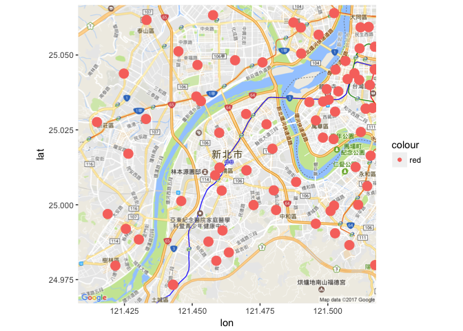

警察局分佈與案發地區分析
================

B0144201戴維政 B0444228林鈺潔

作業說明 （繳交時請直接刪除這個章節）
-------------------------------------

作業目的：期末專題暖身

依下列指示，完成期末分析專題作業規劃：

-   訂出分析問題，並將R Markdown的一級標題(第一行的title:)中的"長庚大學 大數據分析方法 作業六"取代為期末專題的分析問題，並在分析議題背景前加上組員姓名 (`10pt`)
-   分析議題背景 (`10pt`) 與動機 (`10pt`)
-   資料說明 (`10pt`) 與 載入 (`10pt`)
-   資料處理與清洗 (`10pt`) 說明 (`10pt`)
-   對資料們進行探索式資料分析，圖文並茂佳!(`20pt`)
-   期末專題分析規劃與假設 (`10pt`)

分析議題背景
------------

在風聲鶴唳，草木皆兵的社會中，走在路上都有可能被砍，犯罪層出不窮。 \#\# 分析動機 總是在新聞上看到令人無法想像的行為，警察的存在對罪犯而言似乎毫無威脅，因此想分析各地區派出所的數量是否會影響犯罪的數量，進一步探討警力的強度和存在的必要性。 \#\# 使用資料 派出所的所在地點以及近兩年的犯罪分佈地點

``` r
library(readr)
```

    ## Warning: package 'readr' was built under R version 3.2.5

``` r
policeS <- read_csv("~/Downloads/mapdata201705260605/policeS.csv")
```

    ## Parsed with column specification:
    ## cols(
    ##   中文單位名稱 = col_character(),
    ##   英文單位名稱 = col_character(),
    ##   郵遞區號 = col_integer(),
    ##   地址 = col_character(),
    ##   電話 = col_character(),
    ##   POINT_X = col_double(),
    ##   POINT_Y = col_double()
    ## )

``` r
X10401_10403犯罪資料 <- read_csv("~/Downloads/10401-10403犯罪資料.csv") 
```

    ## Parsed with column specification:
    ## cols(
    ##   案類 = col_character(),
    ##   發生日期 = col_integer(),
    ##   發生地點 = col_character()
    ## )

``` r
X10404_10406犯罪資料 <- read_csv("~/Downloads/10404-10406犯罪資料.csv") 
```

    ## Warning: Missing column names filled in: 'X4' [4]

    ## Parsed with column specification:
    ## cols(
    ##   案類 = col_character(),
    ##   發生日期 = col_integer(),
    ##   發生地點 = col_character(),
    ##   X4 = col_character()
    ## )

``` r
X10407_10409犯罪資料 <- read_csv("~/Downloads/10407-10409犯罪資料.csv") 
```

    ## Warning: Missing column names filled in: 'X4' [4]

    ## Parsed with column specification:
    ## cols(
    ##   案類 = col_character(),
    ##   發生日期 = col_integer(),
    ##   發生地點 = col_character(),
    ##   X4 = col_character()
    ## )

``` r
X10410_10412犯罪資料 <- read_csv("~/Downloads/10410-10412犯罪資料.csv") 
```

    ## Warning: Missing column names filled in: 'X4' [4]

    ## Parsed with column specification:
    ## cols(
    ##   案類 = col_character(),
    ##   發生日期 = col_integer(),
    ##   發生地點 = col_character(),
    ##   X4 = col_character()
    ## )

``` r
X10501_10503犯罪資料 <- read_csv("~/Downloads/10501-10503犯罪資料.csv")
```

    ## Warning: Missing column names filled in: 'X4' [4]

    ## Parsed with column specification:
    ## cols(
    ##   案類 = col_character(),
    ##   發生日期 = col_integer(),
    ##   發生地點 = col_character(),
    ##   X4 = col_character()
    ## )

``` r
X10504_10506犯罪資料 <- read_csv("~/Downloads/10504-10506犯罪資料.csv")
```

    ## Warning: Missing column names filled in: 'X4' [4]

    ## Parsed with column specification:
    ## cols(
    ##   案類 = col_character(),
    ##   發生日期 = col_integer(),
    ##   發生地點 = col_character(),
    ##   X4 = col_character()
    ## )

``` r
X10507_10509犯罪資料 <- read_csv("~/Downloads/10507-10509犯罪資料.csv")
```

    ## Warning: Missing column names filled in: 'X4' [4]

    ## Parsed with column specification:
    ## cols(
    ##   案類 = col_character(),
    ##   發生日期 = col_integer(),
    ##   發生地點 = col_character(),
    ##   X4 = col_character()
    ## )

``` r
X10510_10512犯罪資料 <- read_csv("~/Downloads/10510-10512犯罪資料.csv")
```

    ## Warning: Missing column names filled in: 'X4' [4]

    ## Parsed with column specification:
    ## cols(
    ##   案類 = col_character(),
    ##   發生日期 = col_integer(),
    ##   發生地點 = col_character(),
    ##   X4 = col_character()
    ## )

資料處理與清洗
--------------

將近兩年的犯罪資料以地區做合併 再以犯罪資料的發生地區和派出所清理後的地址做合併

``` r
Crimeall<-rbind(X10401_10403犯罪資料,X10404_10406犯罪資料[,1:3],X10407_10409犯罪資料[,1:3],X10410_10412犯罪資料[,1:3],X10501_10503犯罪資料[,1:3],X10504_10506犯罪資料[,1:3],X10507_10509犯罪資料[,1:3],X10510_10512犯罪資料[,1:3])
library(ggmap)
```

    ## Loading required package: ggplot2

    ## Warning: package 'ggplot2' was built under R version 3.2.5

``` r
library(ggplot2)
library("dplyr")
```

    ## Warning: package 'dplyr' was built under R version 3.2.5

    ## 
    ## Attaching package: 'dplyr'

    ## The following objects are masked from 'package:stats':
    ## 
    ##     filter, lag

    ## The following objects are masked from 'package:base':
    ## 
    ##     intersect, setdiff, setequal, union

``` r
policeS_clean<-select(policeS,1:7,-2,-3,-5)
Crimeall$發生地點 <-substr(Crimeall$發生地點, start=1,stop=6)
policeS_clean$地址 <- substr(policeS_clean$地址, start=1,stop=6)
policeS_clean$地址 <-gsub("臺北市","台北市",policeS_clean$地址)

policeF<-group_by(policeS_clean,地址)%>%
  summarise(警察局數量=n())
CrimeF<-group_by(Crimeall,發生地點)%>%
    summarise(案件數量=n())
P_C_F<-inner_join(policeF,CrimeF,by=c("地址"="發生地點"))
```

探索式資料分析
--------------

圖文並茂圖文並茂

``` r
library(ggmap)
twmap <- get_map(location = 'Taiwan', 
                 zoom = 8,
                 language = "zh-TW")
```

    ## Map from URL : http://maps.googleapis.com/maps/api/staticmap?center=Taiwan&zoom=8&size=640x640&scale=2&maptype=terrain&language=zh-TW&sensor=false

    ## Information from URL : http://maps.googleapis.com/maps/api/geocode/json?address=Taiwan&sensor=false

``` r
ggmap(twmap)
```



``` r
policeS_clean$POINT_X<-as.numeric(policeS_clean$POINT_X )
policeS_clean$POINT_Y<-as.numeric(policeS_clean$POINT_Y) 

TWD97TM2toWGS84 <- function (input_lat, input_lon){  
  # input_lat: TWD97橫座標, 南北緯度, latitude N
  # input_lon: TWD97縱座標, 東西經度, longitude E
  
  input_lat <- input_lat %>% as.character %>% as.numeric()
  input_lon <- input_lon %>% as.character %>% as.numeric()
  
  a = 6378137.0
  b = 6356752.314245
  lon0 = 121 * pi / 180
  k0 = 0.9999
  dx = 250000
  dy = 0
  e = (1 - b^2 / a^2)^0.5
  
  
  x =  input_lat - dx # input_lat: TWD97橫座標, 緯度, latitude
  y =  input_lon - dy # input_lon: TWD97縱座標, 經度, longitude
  
  M = y/k0
  
  mu = M/(a*(1.0 - ( e**2 )/4.0 - 3* (e**4)/64.0 - 5* (e**6)/256.0))
  e1 = (1.0 -  ((1.0 -  (e**2))**0.5)) / (1.0 +  ((1.0 -  (e**2))**0.5))
  
  J1 = (3*e1/2 - 27* (e1**3)/32.0)
  J2 = (21* (e1**2)/16 - 55* (e1**4)/32.0)
  J3 = (151* (e1**3)/96.0)
  J4 = (1097* (e1**4)/512.0)
  
  fp = mu + J1*sin(2*mu) + J2*sin(4*mu) + J3*sin(6*mu) + J4*sin(8*mu)
  
  e2 =  ((e*a/b)**2)
  C1 =  (e2*cos(fp)**2)
  T1 =  (tan(fp)**2)
  R1 = a*(1- (e**2))/ ((1- (e**2)* (sin(fp)**2))**(3.0/2.0))
  N1 = a/ ((1- (e**2)* (sin(fp)**2))**0.5)
  
  D = x/(N1*k0)
  
  #緯度計算 latitude
  Q1 = N1*tan(fp)/R1
  Q2 = ( (D**2)/2.0)
  Q3 = (5 + 3*T1 + 10*C1 - 4* (C1**2) - 9*e2)* (D**4)/24.0
  Q4 = (61 + 90*T1 + 298*C1 + 45* (T1**2) - 3* (C1**2) - 252*e2)* (D**6)/720.0
  lat = fp - Q1*(Q2 - Q3 + Q4)
  
  #經度計算 longitude
  Q5 = D
  Q6 = (1 + 2*T1 + C1)* (D**3)/6
  Q7 = (5 - 2*C1 + 28*T1 - 3* (C1**2) + 8*e2 + 24* (T1**2))* (D**5)/120.0
  lon = lon0 + (Q5 - Q6 + Q7)/cos(fp)
  
  
  lat = (lat*180) /pi #南北緯度  latitude 
  lon = (lon*180)/ pi #東西經度  longitude

  WGS = list(lat = lat, lon = lon)
  return(WGS)
}
song<-TWD97TM2toWGS84(policeS_clean$POINT_X,policeS_clean$POINT_Y)

policeS_twmap <- ggmap(twmap) +geom_point(data=policeS_clean, 
               aes(x=policeS_clean$POINT_X, y=policeS_clean$POINT_Y,
                   color="red",size=3.5))+ guides(size=FALSE)
policeS_twmap
```

    ## Warning: Removed 1694 rows containing missing values (geom_point).


期末專題分析規劃
----------------

期末專題要做XXOOO交叉分析
